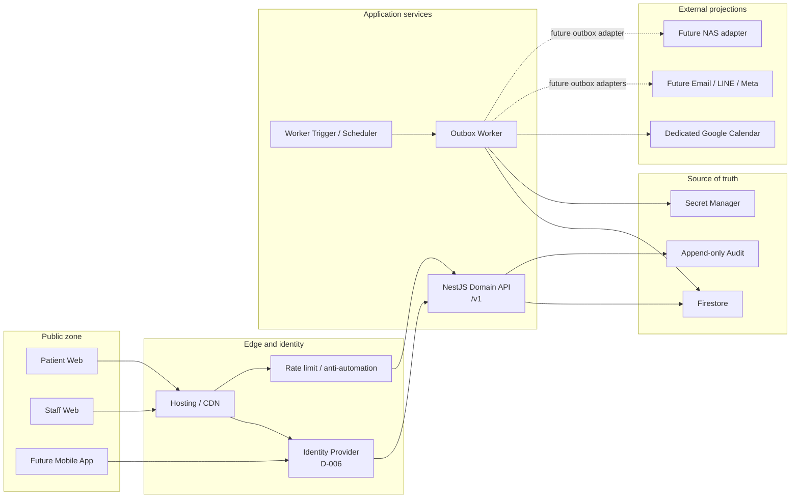

# 正式環境目標架構書

狀態：Proposed  
日期：2026-07-23  
適用範圍：一森渼診所預約平台從合成 preview 過渡至 staging 與 production  
配套規劃：[正式化後續實作規劃書](../product/production-readiness-delivery-plan-2026-07-23.md)

本文件描述技術目標與遷移邊界，不自行核准 D-001～D-011，也不授權處理真實病患
資料、啟用雲端服務或部署 production。

## 1. 架構判定

### 1.1 結論

目前架構的**核心方向正確，不需要推倒重來**：

- client 只經 Domain API 存取資料；
- Firestore 是 source of truth，Calendar 只是投影；
- domain rule 與 I/O 分離；
- 預約、slot、audit、outbox、idempotency 在同一交易；
- worker 在交易外執行外部效果；
- 直接 Firestore client access 預設拒絕；
- UTC 儲存、`Asia/Taipei` 顯示與期間計算；
- browser-local `store.js` 已形成可被正式 API client 取代的 seam。

目前問題是「正式化缺口」，不是架構方向錯誤。若依本文件補齊 application/auth
boundary、contract、資料模型、audit、infra 與 observability，現有 domain、
repository、worker、測試及大部分 UI 都能保留。

### 1.2 保留與修改

| 區域 | 判定 | 處理方式 |
| --- | --- | --- |
| `packages/domain` 純規則與 planner | 保留 | 擴充 schedule、patient identity、case、audit contract；不得加入 SDK/I/O |
| `packages/contracts` 的 Zod schema | 保留機制、重整內容 | 先解決與目前患者欄位、domain request、所有狀態轉換的落差 |
| `apps/api` NestJS/Fastify | 保留 | 新增 identity、application service、policy guard、controller、error mapping |
| `FirestoreBookingRepository` | 保留 adapter 思路 | 以 port 隔離；加入 patient active-booking guard 與完整 audit writes |
| `apps/worker` outbox + Calendar port | 保留 | 補正式 runner、trigger、jitter、metrics、trace、service identity |
| Firestore direct deny rules | 保留 | production 仍 deny client；API Admin SDK 由 IAM 控制 |
| `apps/web` UI | 大部分保留 | `stagingRequest` 換成 versioned API client；角色模擬與 PII localStorage 退場 |
| domain vendor sync | preview 保留 | production web build 改 bundle、content hash、immutable cache |
| `infra/terraform` | 必須建立 | 加 dev/staging/prod、IAM、runtime、Secret Manager、monitoring、budget |

## 2. 必須修改的架構問題

### ARCH-01：API contract、domain request 與 preview 欄位尚未對齊

**現況**

- `CreateAppointmentRequestSchema` 收 `fullName`、E.164 mobile、optional email 與
  privacy acceptance。
- preview 收姓名、電話、生日、身分證、健保卡狀態，沒有 email。
- `BookingRequest` 只接收既有 `patientId`；尚未定義公開患者如何被驗證、建立或
  連結至 `patientId`。
- contract 只有 create/cancel，domain 已有 request cancellation、cancel、
  complete、no-show、reschedule。

**風險**

若直接掛 route，controller、domain 與 UI 將各自猜測資料轉換；optional email
也會繞過目前欄位 allowlist 與 D-001～D-003 gate。

**修改**

1. D-001～D-006 未核准前，不開 route。
2. 先決定 public booking identity flow，再建立獨立的 patient intake／identity
   contract；appointment command 優先只傳 opaque `patientId`。
3. contracts 補齊 command/response/error/version，所有 controller 只接受
   executable schema。
4. 刪除未核准欄位，不以「optional」規避 privacy decision。

**Stage 0 實作狀態（2026-07-24）：contract 邊界已完成**

- create appointment schema 已縮為 idempotency key、slot、service 與 booking kind；
  strict schema 會拒絕 email、patient profile、patient ID、actor、role、client time、
  privacy acceptance 與任意文字；
- `AppointmentApplicationService.create` 將 server-verified opaque patient/actor
  與 server-generated ID/time/correlation 映射為 `BookingRequest`；
- ADR-0005 固定 patient intake／verification 與 appointment command 分離，實際
  欄位、驗證、matching、merge 與 retention 仍依 D-001～D-003/D-006/D-011
  保持 TBD；
- API v1 文件已盤點 health、patient identity、appointment transitions、
  reschedule、follow-up、schedule、case 與 payroll commands，以及完整 error code
  與 HTTP/domain mapping。尚未核准的項目只列 inventory，不建立 executable
  contract 或 route。

### ARCH-02：缺少 application 與正式 security boundary

**現況**

`apps/api` 只有 health controller；repository 直接接受已組好的 domain request，
尚無正式 actor、clock、ID、policy、rate limit、correlation ID 與 authorization
orchestration。

**修改**

```text
Controller
  -> Authentication Context
  -> Authorization Policy
  -> Application Service
  -> Domain Planner
  -> Repository Port
  -> Firestore Adapter
```

- controller：schema parse、HTTP mapping，不放 business rule；
- authentication：驗證 session/token，產生不可由 body 覆寫的 actor；
- authorization：檢查 action + resource scope；
- application service：產生 ID/time、載入 policy version、呼叫 domain/repository；
- repository port：定義 application 所需能力；
- Firestore adapter：只有資料庫 I/O，不自行發明規則。

**Stage 0 實作狀態（2026-07-23）：未掛路由骨架已完成**

- `AuthenticationContext`、`AppointmentAuthorizationPolicy`、
  `AppointmentRepositoryPort` 與 `AppointmentApplicationService` 已建立；
- actor、role 與 verified patient 只能由 authentication context 傳入；
- `AppModule` 仍只註冊 health controller；真 IdP、RBAC、resource scope、
  rate limit、maintenance 與 HTTP error mapper 仍依決策 gate 保持未實作。

### ARCH-03：active-booking invariant 應改為明確 guard document

**檢視時現況**

repository 以 transaction query 計算同病患的 active appointments。Firestore
交易提供 serializable isolation，但目前測試只覆蓋：

- 多病患競爭同一 slot；
- 同病患先後建立第二筆預約。

尚未固定「同病患同時預約兩個不同 slots」的競態測試。這個規則是高價值 invariant，
不應只依賴 query range 的隱含衝突語意。

**修改**

建立 `patient_booking_guards/{patientId}`：

```json
{
  "activeAppointmentId": "appointment_...",
  "status": "confirmed",
  "updatedAt": "UTC timestamp"
}
```

booking transaction 固定讀寫同一個 patient guard 與目標 slot；完成、取消、
no-show 時條件式釋放，改期時保留。如此同病患不同 slot 的併發請求會明確競爭
同一文件，也省去 active appointment query。

驗收：同一 `patientId` 對兩個不同 slots 同時送出 N 個 request，恰好一個成功；
guard、appointment、slot、audit、outbox、idempotency 不得出現部分寫入。

**Stage 0 實作狀態（2026-07-23）：已完成**

- `planBooking` 以明確 guard snapshot 判斷 active booking，不再接收 query count。
- Firestore transaction 固定讀取並建立
  `patient_booking_guards/{patientId}`，不再查詢 active appointments。
- cancellation request 與 reschedule 保留／更新 guard；cancel、complete、
  no-show 只釋放仍指向該 appointment 的 guard。
- Emulator 以同一 synthetic patient 同時競爭 8 個不同 slots，驗證恰好一筆成功，
  且 appointment、guard、slot、audit、outbox、idempotency 各只留一筆。

### ARCH-04：audit contract 不足以支援正式稽核

**現況**

主要欄位只有 `id/action/appointmentId/actorId/occurredAt`；preview audit 可由
localStorage 修改或清除。

**修改**

正式 audit 至少包含：

```text
eventId, occurredAt, actorId, actorRole, action,
resourceType, resourceId, before, after, reasonCode,
result, correlationId, source, policyVersion, schemaVersion
```

- 與業務寫入同交易；
- append-only，不提供一般 update/delete；
- payload 去識別化，不複製不必要 PII；
- retention、export、break-glass 與查看權限由 D-002/D-006 決定。

**Stage 0 實作狀態（2026-07-23）：已完成**

- `AuditEventV2Schema` 固定完整 envelope 與 `schemaVersion: 2`。
- appointment `before/after` 僅允許 `status`、`slotId`；schema 會拒絕病患識別、
  聯絡資訊與任意文字。
- actor、role、correlation、source 由 server-owned audit context 提供；request
  body 不能覆寫。D-006 尚未核准，因此不預先枚舉正式診所角色。
- `reasonCode`、`policyVersion` 欄位必須存在但可為 `null`，直到對應決策核准，
  不以 synthetic 值冒充正式政策。
- 建立、狀態轉換與改期在同一 Firestore transaction 使用 `create` append event；
  同 event ID 已存在時整筆交易回滾，不覆寫原事件。
- Emulator assertions 驗證完整 v2 envelope、狀態前後值、PII allowlist、冪等重放
  與 append-only 衝突的零部分寫入。

### ARCH-05：排班、患者、個管規則仍部分只存在 browser modules

**現況**

appointment 核心規則已收斂至 `packages/domain`，但 schedule publish、
patient identity、case assignment、workspace governance 仍以 browser module
為主。

**修改順序**

1. `schedule-engine` 的 validate/impact/version invariant 移至 domain；
2. patient identity 正規化與 opaque identifier mapping 移至受保護 application
   module；raw national ID 不作 document ID；
3. case assignment/effective period/merge review 移至 domain；
4. UI 只保留 rendering、input hint 與 error-code 翻譯。

### ARCH-06：preview 的 raw identity key 不得移植至 production

**現況**

preview 使用完整身分證或電話+生日作 identity key，整份 state 存 localStorage。
這在目前明示的 synthetic preview authority 內可用，但不能作正式身分模型。

**修改**

- production document ID 一律 opaque；
- raw national ID 不進 URL、document ID、log、correlation ID 或 idempotency key；
- 是否儲存 national ID、是否使用 HMAC blind index、如何驗證本人及保存多久，
  由 D-001～D-003/D-006 決定；
- UI 不再持久化完整 patient state；只保存短期、非敏感的 view/session state。

### ARCH-07：worker 尚缺正式執行與觀測邊界

**現況**

lease、retry、dead-letter、requeue 與 Calendar port 已完成，但沒有 production
trigger/scheduler、queue SLO、trace、alert 與正式 service identity。retry 目前為
確定性 exponential backoff，沒有 jitter。

**修改**

- 使用受 D-010 核准的 worker runtime/trigger；
- full jitter，避免外部故障恢復時同步重試；
- metrics：oldest pending age、pending/in-progress/dead-letter count、attempt
  rate、success/error rate、Calendar latency；
- 每個 job 傳遞 correlation/causation ID；
- dead-letter alert 與 runbook drill 成為 release gate。

**Stage 0 實作狀態（2026-07-23）：ports 與 contract 已完成**

- booking/transition/reschedule 建立 outbox 時沿用 server correlation ID，並以
  同交易的 audit event ID 作 causation ID；
- worker 在外部 I/O 前驗證 trace context；缺漏或非 opaque 值直接進死信，不會
  呼叫 Calendar；
- Calendar port 接收 trace context，但 Google event payload 不包含 trace ID；
- `WorkerMetricsPort` 固定 Calendar attempt、batch、queue snapshot shape；metric
  labels 不含 appointment/patient/trace ID，adapter 故障不改變 delivery；
- full-jitter design 固定為 `uniform(0, min(cap, base × 2^(attempt-1)))`。目前純
  domain 仍採 deterministic backoff；random source、runner、metrics backend、
  queue aggregation、alerts 與 service identity 等 D-010/Stage 3 核准後接線。

### ARCH-08：production infrastructure 尚未形成 executable architecture

**現況**

`infra/terraform` 只有邊界說明，沒有 resources/modules/environments。

**修改**

- dev/staging/production 分離；
- API/worker service accounts 分離且 least privilege；
- Secret Manager、key rotation、audit log；
- Firestore location/index/backup/PITR/restore；
- runtime、scheduler/task queue、monitoring/alerts/budget；
- deployment identity、approval、rollback；
- tfstate 使用受控 remote backend，不進 repository。

具體 project、region、runtime、owner 與 cost policy 由 D-010 核准。

### ARCH-09：production Web 與 CI gate 尚未完成

**修改**

- production build 使用 bundle + content hash；
- HTML revalidate、hashed assets immutable；
- staff 與 patient surface 採不同 index/auth/cache policy；
- CI 加 browser E2E、API negative test、axe、Lighthouse budget、dependency、
  secret、SAST、SBOM；
- staging 與 production headers/robots/canonical 分離。

## 3. 目標容器架構



### 不可信輸入

- browser body/header/origin；
- mobile/social webhook payload；
- localStorage；
- Calendar response/error；
- client-provided actor、role、patientId；
- client time、ID、policy version。

以上皆須在 server boundary 驗證或由 server 產生。只有驗證後的 identity context
可以成為 audit actor。

## 4. API 內部分層

建議結構：

```text
apps/api/src/
  platform/
    auth/
    authorization/
    correlation/
    errors/
    rate-limit/
  modules/
    appointments/
      appointment.controller.ts
      appointment.application-service.ts
      appointment.repository-port.ts
      appointment.policy.ts
      firestore-appointment.repository.ts
    schedules/
    patients/
    cases/
    privacy/
    audit/
  app.module.ts
```

依賴方向：

```text
controller -> application -> domain
                         -> repository ports
Firestore adapter ------> repository ports
domain -----------------> nothing outside packages/domain
```

禁止：

- controller 直接呼叫 Firestore；
- repository 決定角色、政策、流程或 user-facing message；
- domain 讀環境變數、時鐘、UUID、SDK；
- client 傳入 actor 作為可信身分；
- Firestore transaction 呼叫 Calendar/notification/NAS。

## 5. 目標資料模型

| Collection | 用途 | 關鍵 invariant |
| --- | --- | --- |
| `patients` | opaque patient profile | 無 raw identity 作 document ID；merge 有 lineage |
| `patient_identifiers` | 受限制的 identity mapping | 欄位、索引與保存依 D-001～D-003/D-006 |
| `patient_booking_guards` | 每病患 active booking 唯一 guard | 同病患同時最多一筆 active |
| `appointments` | 預約 source of truth | 狀態機、service/resource/rule version |
| `slots` | 可預約容量 | slot/resource/start 唯一；transaction reservation |
| `schedule_drafts` | 未發布排班 | revision + editor；患者不可讀 |
| `schedule_versions` | immutable published versions | version、diff、approval、rollback target |
| `follow_ups` | 人工回診決定 | 只能綁 completed appointment |
| `case_assignments` | effective-dated 指派 | reassignment history 不覆寫 |
| `privacy_policy_versions` | immutable policy | published version 不可覆寫 |
| `privacy_acceptances` | patient acceptance evidence | patient + version + acceptedAt + channel |
| `audit_events` | append-only evidence | 同交易、完整 actor/resource/result |
| `idempotency_keys` | request replay | 綁 actor/scope/request hash/response reference |
| `outbox_jobs` | 外部效果意圖 | lease、retry、dead-letter、causation ID |
| `calendar_links` | projection reconciliation | appointment ↔ event ID，不含 PII |
| `payroll_credits` | 規則版本化 credit | unique key + effective assignment |
| `payroll_periods` | close/lock snapshot | lock 後只允許 adjustment |

### 5.1 Idempotency v1 executable contract（Stage 0）

2026-07-23 已在 local/Emulator 固定以下邊界：

- application service 以明確排序的業務欄位計算 canonical SHA-256；建立預約時
  server 新產生的 appointment ID、request time、correlation ID 不進 request
  hash；
- Firestore 文件 ID 由 `actorId + operation scope + raw idempotency key`
  的 SHA-256 產生，原始 key 不持久化；
- record 僅保存 actor、scope、request hash、appointment response reference、
  UTC recorded time 與 schema version；
- actor、scope、request hash 完全相同才回放原 appointment；同一 scoped key
  對不同內容拋出 `IDEMPOTENCY_KEY_REUSED`，且在任何 sibling write 前終止；
- 相同 raw key 可由不同 actor 或不同 operation scope 獨立使用。

## 6. 關鍵交易

### 6.1 建立預約

交易前由 application service 完成：

1. authentication／patient verification；
2. authorization、rate limit、maintenance gate；
3. contract parse；
4. server 產生 appointment ID、request time、actor、policy/rule version；
5. request hash 與 idempotency scope。

Firestore transaction：

1. 讀 idempotency record；
2. 讀 patient booking guard；
3. 讀 slot；
4. domain planner 驗證；
5. 建立 appointment；
6. reserve slot；
7. 建立／更新 patient guard；
8. append audit；
9. 建立 outbox；
10. 建立 idempotency record。

任何一步失敗都不得留下部分寫入。

### 6.2 狀態轉換

- request cancellation：guard 保留；
- cancel/completed/no-show：條件式釋放 slot 與 patient guard；
- reschedule：同交易讀舊 slot、新 slot、guard，釋放舊 slot 並保留新 slot；
- completed 必須由 D-006 核准角色執行並記 reason/source；
- 每次都 append audit + outbox + idempotency。

### 6.3 排班發布

1. 讀 draft revision 與 expected published version；
2. domain 驗證 intervals/exceptions/capacity；
3. 計算 diff 與 impacted appointments；
4. 無未處理 impact 且 approval 成立才 publish；
5. 建立 immutable schedule version；
6. 更新 current pointer；
7. append audit；
8. 衝突回 `409 VERSION_CONFLICT`。

### 6.4 Outbox

```text
pending -> in_progress (lease)
          -> completed
          -> pending (retry + jitter)
          -> dead_letter (alert + operator)
```

外部服務回應遺失時，同一 idempotency key 重送；Calendar upsert 不得建立第二筆。

## 7. Authorization 模型

正式判斷是：

```text
allow = authenticated
     && account active
     && role permits action
     && resource scope permits target
     && policy conditions satisfied
```

最低角色集合由 D-006 核准，候選包含：

- Patient；
- Front Desk；
- Case Manager；
- Manager；
- System Admin；
- Auditor；
- Service Account。

UI 隱藏只改善體驗，不是控制。所有敏感 action 與 read query 都必須在 API
重做授權；查詢結果亦需 server-side scope/filter/field projection。

## 8. Deployment 與環境

```text
development: local services + Emulator + fake integrations
staging: isolated cloud project + synthetic data + test identities/calendar
production: separate project + approved real-data controls
```

不得共用：

- project/database；
- service account；
- Secret Manager secret；
- Calendar；
- deployment identity；
- backup bucket；
- analytics/log destination。

production release 必須是 immutable artifact promotion，不在 production console
手動改程式或 Rules。

## 9. Observability

每個 request/job 使用 opaque correlation ID：

- API：request count、latency、4xx/5xx、auth deny、409/429；
- Firestore：transaction retry/abort、contention、latency；
- outbox：oldest age、queue depth、attempts、dead-letter；
- Calendar：upsert/cancel、latency、retryable/non-retryable error；
- privacy：rights request SLA、retention/delete job；
- security：failed login、MFA、privilege/account changes。

logs 不得包含姓名、電話、身分證、生日、醫療備註、token 或 Calendar credential。

## 10. 遷移策略

| 現況 | 過渡 | 目標 |
| --- | --- | --- |
| `stagingRequest` | 實作相同 command 語意的 `api-client` | HTTPS `/v1` |
| local account switch | staging test identities | IdP + server auth context |
| localStorage patient/state | synthetic-only 保留至 API ready | server DTO + minimal session state |
| browser schedule publish | domain extraction + API contract | versioned Firestore transaction |
| browser audit | 擴充 audit schema | append-only audit collection |
| repository-only | application service + ports | routed authenticated API |
| manual worker test | staging trigger + metrics | production worker SLO |
| raw ESM/no-store | production build pipeline | hashed immutable assets |

不要做 big-bang migration。每個 module 以 contract-compatible adapter 替換，
並在同一組 synthetic acceptance tests 下比較 preview adapter 與 API adapter。

## 11. 架構驗收

正式資料前必須證明：

1. D-001～D-011 中與 release scope 有關的項目已核准；
2. public/staff flow 不再持久化 PII 至 localStorage；
3. client 無法直接讀寫 Firestore；
4. actor 只能來自 server-verified identity；
5. 同 slot 競態與同 patient/不同 slot 競態都恰好一個成功；
6. 所有 write path 有 validation、authorization、idempotency、audit；
7. schedule publish 有 version conflict、impact review 與 rollback；
8. Calendar/notification 故障不影響 source transaction，且可安全補回；
9. backup restore、alert、incident、rollback 已演練；
10. E2E、a11y、performance、security gates 在 CI 可重現。

## 12. 參考

- [領域邊界與不變條件](domain-boundaries.md)
- [API v1 contract baseline](api-v1-contract.md)
- [Calendar 與資料庫整合計畫](calendar-and-database-integration-plan.md)
- [ADR-0001 — API only write path](../adr/0001-domain-api-is-the-only-write-path.md)
- [ADR-0002 — Calendar projection](../adr/0002-calendar-is-a-projection-not-the-lock.md)
- [ADR-0003 — Firestore deny by default](../adr/0003-firestore-direct-client-access-is-deny-by-default.md)
- [Firestore transaction serializability and isolation](https://firebase.google.com/docs/firestore/transaction-data-contention)
- [Firestore transactions and retries](https://firebase.google.com/docs/firestore/manage-data/transactions)
