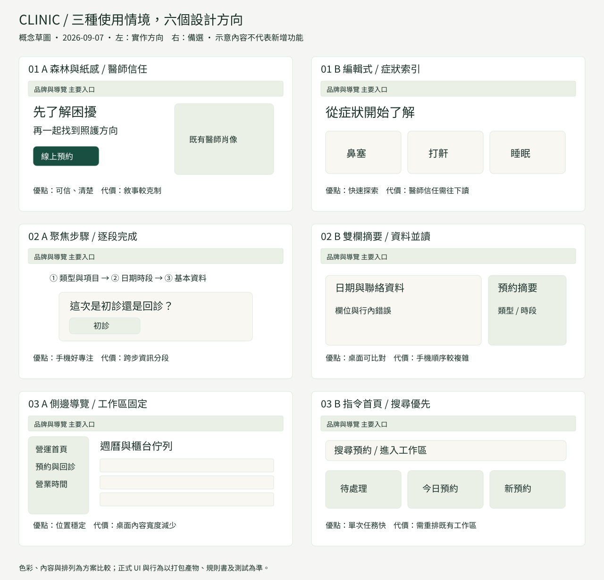

# Clinic UI/UX 重設計：研究、方案與設計系統

日期：2026-09-07。此為本次 PR 的設計依據與審查候選，沒有營運、醫療政策、部署或認證效力。
執行範圍見[實作計畫](2026-09-07-ui-ux-redesign-plan.md)，結果見[交接與驗證](../reviews/2026-09-07-ui-ux-redesign.md)。

## 1. 調查起點

已 fetch；分支由 `origin/main@df51b5ae32e74cbd0236f1367545c75205320adf` 建立。
該版 [Verification run 34085134618](https://github.com/waydefu/clinic/actions/runs/34085134618) 為成功。
這只是 before 基線證據，不能代表本 PR 通過。

| 當時開放 PR | 範圍 | 本次關係 |
| --- | --- | --- |
| [#78](https://github.com/waydefu/clinic/pull/78) | T3-Q-01 coverage，head `6f4c1328bb457785898720e3664521fbd601ea61` | 保留其五個測試／helper 檔；本次新增獨立測試。合併順序變動後仍須回歸 |
| [#77](https://github.com/waydefu/clinic/pull/77) | 狀態文件 | 不搬入其變更 |
| [#76](https://github.com/waydefu/clinic/pull/76) | BOOK-PILOT plan-only | 不構成啟用 booking API 或部署權限 |

[決策登錄](../product/phase-1-decision-register.md) 中 D-001～005、D-011 等營運前置尚未全部完成；
D-006、D-010 的政策決定不等於部署授權。這次只重設計合成預覽。
實際前端是原生 ES modules 與本機合成狀態，沒有 Redux，也不需要更換框架。

## 2. 實際路由與任務

| 入口 | 次級內容／流程 | 使用者需要 |
| --- | --- | --- |
| `/clinic` | `/clinic/doctors`、`/clinic/doctors/yan-cheng-an`、`/clinic/doctors/yang-sheng-feng` | 認識醫師、症狀與既有公開照護資訊，找到聯絡與預約入口 |
| 鼻功能醫學 | `/clinic/nasal/snoring-five-in-one`、`inferior-turbinate-surgery`、`septoplasty`、`snore-relief-mouthguard`（後三者同一路徑前綴） | 可掃讀的服務與衛教、FAQ、麵包屑返回 |
| `/booking` | 類型與項目 → 日期時段 → 基本資料 → 成功；查詢、取消、改期為既有畫面／dialog | 清楚知道目前步驟、保留選擇、修正錯誤與取得回饋 |
| `/staff` | 七個既有工作區，hash 深連結；週曆、佇列、處置與權限拒絕 | 固定位置的導覽、掃描狀態、直接操作與鍵盤捷徑 |
| `/privacy`、404 | 隱私草稿、錯誤恢復 | 不把草稿當已生效承諾；回到可用入口 |

需求中的 `/booking/lookup`、`/staff/appointment` 是舉例，並非現有路由。
不新增失去契約支援的 URL；現有返回、focus restore、三步表單與成功狀態繼續由原控制器管理。

## 3. 研究轉為設計決策

| 一手來源 | 採用原則 | 本次具體決策／界線 |
| --- | --- | --- |
| [WCAG 2.2](https://www.w3.org/TR/WCAG22/) 與 [Target Size Minimum](https://www.w3.org/WAI/WCAG22/Understanding/target-size-minimum.html) | 一般文字 4.5:1，大字 3:1；AA 目標尺寸 24 CSS px 並有例外 | 保留專案更高的主要控制項 44px；axe 明確啟用 target-size，不能把 44px 誤說成 WCAG AA 的通用數字 |
| [Apple HIG Motion](https://developer.apple.com/design/human-interface-guidelines/motion) | 動效須有目的，尊重減少動態 | 首屏文字立即可讀；次要 reveal、選取與處置回饋維持 reduced-motion 分支；不加入輪播、影片或新動畫函式庫 |
| [Material States](https://m3.material.io/foundations/interaction/states/overview)、[Layout](https://m3.material.io/foundations/layout/canonical-examples/overview) | 狀態一致、依空間調整佈局 | 表面、框線、選取、disabled 共用語意 tokens；桌面 rail、手機局部橫捲導覽 |
| [Android 觸控目標](https://support.google.com/accessibility/android/answer/7101858?hl=en-GB) | Android 建議 48dp | dp、Apple pt、CSS px 不是跨裝置一比一；本 Web PR 以專案 CSS px gate 驗證 |
| [NHS Error Summary](https://service-manual.nhs.uk/design-system/components/error-summary) | 錯誤摘要在上方、連到欄位、摘要與行內訊息一致 | 保留已存在的錯誤摘要、焦點與行內說明。警告仍有文字，不靠紅色；不自行增加尚未批准的取消規則 |
| [NN/G 視覺原則](https://www.nngroup.com/articles/principles-visual-design/) 與 [十項可用性原則](https://www.nngroup.com/articles/ten-usability-heuristics/) | 尺度、層次、群組；狀態可見、辨認優於記憶 | 官網左對齊標題；預約三個步驟標籤全露出；工作臺固定 rail；不新增只有圖示的主要動作 |
| [Core Web Vitals](https://web.dev/articles/vitals?hl=en)、[門檻定義](https://web.dev/articles/defining-core-web-vitals-thresholds?hl=en) | p75，手機／桌面分開；LCP ≤2.5s、INP ≤200ms、CLS ≤0.1 | 固定原 budget，零下載字型。lab paint 加入官網；本機測試不冒充 field INP，TBT 也不能當 INP |
| [台灣無障礙網路空間服務網](https://accessibility.moda.gov.tw/) | 依適用規範與實際檢測程序判定 | 2026-06-08 公告所列新檢測措施預定 2026-11-30 啟用，不能提前當成已施行；本次沒有取得任何無障礙標章 |

台灣法規、個資或醫療文案不是由這張視覺表批准；適用性與正式審查仍由 owner 依既有治理處理。

### 案例比較

- [NHS GP appointments](https://www.nhs.uk/nhs-services/gps/gp-appointments-and-bookings/)：以看診與預約任務組織內容。
  適用於 Clinic 的是清楚入口與平實說明，不能照搬 NHS 的資格、時程或緊急服務政策。
- [Kaiser appointments help](https://healthy.kaiserpermanente.org/southern-california/support/help/appointments)：把查詢、改期、取消及替代聯絡管道放進同一任務脈絡。
  Clinic 保留既有管理 dialog，避免另一條平行預約流程。
- [Awwwards：La Guía de Cirugía Cardíaca](https://www.awwwards.com/sites/la-guia-de-cirugia-cardiaca)：SOTD，總分 7.23/10，提供病程階段式視聽導引。
  取其淡色背景、內容分段與旅程組織；不引入新的影音成本或診療內容。
- [Awwwards：The Frontier Within](https://www.awwwards.com/sites/the-frontier-within)：2019-07-23 SOTD，總分 7.88/10，以身體系統做互動敘事。
  可借鏡主題一致性；其 WebGL／實驗型互動不適合本次預約與 PRoot 限制。獎項分數不是 WCAG 或醫療可用性證據。

以上是根據來源內容與本地任務的設計推論，沒有宣稱參考站已通過本專案的 gate。

## 4. 基線觀察與六種方向

before 使用未改版 main 的打包產物。全部頁面固定同一合成時間；診所 light，booking／staff 預設 warm。
原先主視覺插畫、重漸層與弧形遮罩偏向宣傳；大量置中區段降低掃讀一致性。
預約手機頁首與公告占用首屏，只有目前步驟有名稱。工作臺橫向導覽與區段留白使週曆／佇列出現較晚。
此外，完整表單在此 ARM64 Chromium 的 main 基線可重現 35px／68px 溢出，響應式分數包含該發現；初始頁截圖不能代表後續狀態。
這些是可觀察的版型問題，不推導患者轉換率或員工工時收益。

| 介面 | A：本次實作 | B：備選 | 選擇理由與代價 |
| --- | --- | --- | --- |
| 官網 | 森林與紙感：完整醫師肖像、左側文案、方形 CTA、平面分區 | 編輯式症狀索引：分類與閱讀入口放在主視覺 | A 用既有已批准影像建立信任；B 可探索性較高，但首屏醫師資訊較弱 |
| 預約 | 聚焦步驟：平面標題帶、三步標籤、單一表單表面 | 雙欄摘要：桌面欄位與摘要並讀 | A 可直接保留原事件與焦點契約；B 在手機需要更多閱讀順序設計 |
| 工作臺 | 固定側欄：七個既有工作區、清楚 current、主要區域更早出現 | 指令首頁：搜尋、待處理、最近操作優先 | A 維持既有深連結與認知位置；B 需要更大流程變更，這次不引入 |

三者沿用同一品牌色、字體與狀態語意，工作臺不複製官網的大型行銷版型。
所有次頁透過同一 clinic 標題、按鈕、容器及色彩更新，不變更公開醫療文案。

## 5. Tokens：以程式為唯一值來源

共用值位於 `apps/web/public/styles.css`；官網映射在 `clinic-site.css`。
此表是設計字典，修改數值時以程式、token gate 與對比測試同步，避免第二套 CSS。

| 類別 | 本次規範 |
| --- | --- |
| 主色／深主色 | 共用 light 與官網 `#184f40`／`#103b30`；主要動作、標題與選取，非全部裝飾都用高飽和 |
| 中性色 | 官網紙色 `#f8f7f2`、霧綠 `#eaf0e6`、墨色 `#182e27`；共用 canvas `#f5f6f3`。warm／dark 保留各自語意覆寫 |
| 語意狀態 | 沿用 danger、status、focus、inverse token；light danger `#a83737`，dark `#e08f8f`；文字／圖形同步表達狀態。品牌金不承擔系統狀態 |
| 字型 | 系統 sans：PingFang TC、Microsoft JhengHei、Noto Sans TC 等；品牌標題才用系統 serif。沒有新增字型檔或授權資產 |
| 字級 | micro 0.875rem 只用次要標籤；body 1rem；md 1.2rem；lg 1.44rem；xl 1.728rem；2xl 2.074rem；3xl 2.488rem。表單與回饋不縮成 micro |
| 間距 | 2、4、8、12、16、20、24、32、48、64px 的既有 rem 刻度；主要 panel 桌面 32px、平板 24px、手機 16px |
| 圓角／深度 | 共用 sm 8px、md 12px、lg/xl 16px；官網卡片 12px、CTA 用既有 sm。一般區塊採框線與底色分層，浮層才保留深度 |
| 動效 | 保留 `--motion-*` 與 `--ease-standard`、`--ease-decelerate`；主要文案不淡入。hover 不位移表單卡片，reduced-motion 不失去選取或處置回饋 |
| 佈局 | 官網 shell 上限 76rem；患者 main 64rem；工作臺 92rem，桌面 11rem rail 加 minmax(0,1fr)。既有 30／48／64rem 斷點保留 |

既有 clinic token 的間距技術債仍由 ratchet 保護；不為本次視覺改動新增任意色或提高上限。

## 6. 元件與模式

| 元件／模式 | 用途及必須保留的狀態 | 本次處理 |
| --- | --- | --- |
| Header、brand、CTA | 一般、focus、mobile、preview badge | 品牌與方形按鈕一致；測試告示不可消失 |
| Clinic hero／section／service／doctor card | 圖片載入、完整 alt、麵包屑、選取服務 | 完整肖像與下方說明；左對齊閱讀層次 |
| Stepper／back／context | current、complete、三步名稱、返回保留 | 手機所有步驟有文字；原步驟控制器不動 |
| Button／choice／input／select | normal、hover、focus-visible、pressed、disabled、error | 框線／底色與狀態雙重呈現；保留 44px 與 accessible name |
| Error summary／inline error／status | loading、success、conflict、error、retry | 既有訊息及 live region 不變，視覺不藏錯誤 |
| Dialog／management／confirmation | open、Escape、focus trap／return、cancel、reschedule | 共用 token 更新；保留電話 fallback 及確認契約 |
| Workspace nav／toolbar | current、keyboard、scroll、權限可見性 | 桌面 rail；手機保留標籤與局部捲動 |
| Week calendar／appointment queue／pagination | 0／1／多筆、衝突、處置、長文字、focus | 降低表面陰影、保留文字狀態與原動作順序 |
| Case／settings／audit | role denied、empty、maintenance、populated | 接收共用字色及框線；不新增資料或寫入邏輯 |
| Privacy／404 | 草稿、恢復入口、無 JS | 原控制流程與公告不變 |

沒有本次新需求支持的新圖表；不用裝飾性圖表或假營運數字填工作臺。

## 7. 執行節點與負責人

| 階段 | 本次交付／完成條件 | 負責人 | 時程 |
| --- | --- | --- | --- |
| 現況／基線 | main、PR、決策、未修改 dist、同條件截圖 | Codex | 2026-09-07，本工作階段 |
| 方案／系統 | 六概念、tokens、元件、Figma 計畫 | Codex | 同工作階段，實作前計畫／交付時補齊比對 |
| 版型／互動 | 五個前端 owning files；回歸先失敗再修正 | Codex | 同工作階段 |
| 自動驗證 | 本機適用 gate、CI exact commit、T3-Q-01 整合 | Codex／CI | 本 PR 與整合後提交 |
| 審查與實機 | 主觀評分複核、§5.2／§5.3、Figma 資產採納 | owner／指定設計與 QA | owner 安排；未假設已執行 |

使用者提供的 20 日時程是估算範例，未建立排程或未來自動執行承諾。

## 8. Figma 整合與呼叫節省

本次沒有呼叫 Figma API；先用本地 HTML/CSS、SVG 與 PNG 建立可審閱成果。
「學生方案一定只有很少次數」不宜作固定事實：目前官方
[MCP rate limits](https://developers.figma.com/docs/figma-mcp-server/rate-limits-access/)
列 Education 的 Dev／Full seat 上限為每日 200 calls、每分鐘 10 calls；
[REST limits](https://developers.figma.com/docs/rest-api/rate-limits/) 另依 seat、file plan 及 endpoint tier 計算。
這不是對使用者實際 seat、額度或 API 權限的確認，開始同步時需再查。

| 資產 | 實際來源／格式 | 同步規則 |
| --- | --- | --- |
| Logo／標章 | `apps/web/public/brand/` 既有資產；clinic logo WebP | 原檔 reuse，附來源與 SHA，不外傳 public mirror |
| 醫師／服務圖片 | `apps/web/public/clinic-assets/`、既有 manifest | 不裁肖像、不重生成真人；本次無新增授權來源 |
| Icons | 現有 DOM/SVG 圖示 | 按用途批次整理，不逐一 API export |
| Colors／type／spacing | 兩份 CSS token 區段 | 一次建立命名映射與 light／warm／dark modes；官網目前 light，勿假造三主題 |
| Fonts | 系統字體堆疊清單 | 不匯出 OS 字型檔；Figma substitute 要標註排版差異 |
| Components | 上節矩陣 | variants = default／focus／selected／disabled／error；用共享 component，不每頁複製樣式 |
| Screens／legend | 本次 before／after PNG、manifest、六概念 SVG | 用 revision＋SHA 去重；legend 說明合成狀態、viewport、theme、限制 |
| Motion | CSS token 與 reduced-motion 說明 | 不需要 Lottie／影片資產 |

建議單一設計檔：`00 Read me`（版本與限制）、`01 Foundations`（Variables／Type／Spacing）、
`02 Components`、`03 Clinic`、`04 Booking`（三步／成功／管理）、`05 Staff`（工作區／empty／populated）、
`06 Review`（before／after／未決項）。初期一批匯入資產與參考圖；之後只同步 SHA 改變的項目。
先批次取得必要節點、共用回傳結果，避免逐元件 get/export；429 遵守 Retry-After，禁止無限重試。
不建立第二份「正式實作」；Figma 是資產與 review 層，程式與治理仍為來源。

## 9. 百分評分：補充設計評審，不等於發布驗收

提示詞沒有提供可計算的細項權重。此處在同一六面向上明定：視覺 20、可用性 25、
動效 10、響應式 15、可及性 20、效能 10；每項 1～5，總分為 Σ(權重 × 評分 ÷ 5)。
1=妨礙任務，3=可用但有明顯摩擦，4=一致且通過可執行檢查，5=細節成熟且沒有觀察到摩擦。
小數是設計者的桌面評審判斷，沒有統計顯著性或使用者研究意義。

| 頁面／版本 | 視覺 | 可用性 | 動效 | 響應式 | 可及性 | 效能 | 加權總分 |
| --- | ---: | ---: | ---: | ---: | ---: | ---: | ---: |
| clinic before | 3.8 | 4.0 | 4.0 | 4.3 | 4.3 | 4.8 | 82.9 |
| booking before | 4.0 | 4.0 | 4.5 | 3.3 | 4.3 | 4.8 | 81.7 |
| staff before | 3.8 | 3.9 | 4.5 | 3.3 | 4.3 | 4.8 | 80.4 |
| clinic candidate | 4.8 | 4.6 | 4.7 | 4.6 | 4.6 | 4.8 | 93.4 |
| booking candidate | 4.6 | 4.7 | 4.8 | 4.7 | 4.6 | 4.8 | 93.6 |
| staff candidate | 4.6 | 4.6 | 4.7 | 4.6 | 4.6 | 4.8 | 92.6 |

加分依據：完整 portrait＋固定 caption 的視覺層次、三步名稱與縮短頁首、固定 rail、
首屏無 opacity 進場、同條件多寬度截圖、保留 axe／geometry／功能 gate 及 byte budget。
未給滿分：長頁仍多資訊、工作臺佇列仍需捲動、系統字體跨 OS 不同、實機與 field 指標未取得。
before 的可及性評分只根據當時穩態掃描與既有 CI，不代表進場每一幀皆已通過。

候選桌面評分達 92，但 **owner 獨立評分與完整驗收仍未完成**。
任一 hard defect 或 gate FAIL 都優先於分數；數字不能抵銷焦點失效、溢出、業務退化或 performance 超標。
§5 矩陣、實機讀屏、field CWV 與尚未批准的營運條件未補齊前，不宣稱可生產上線。
