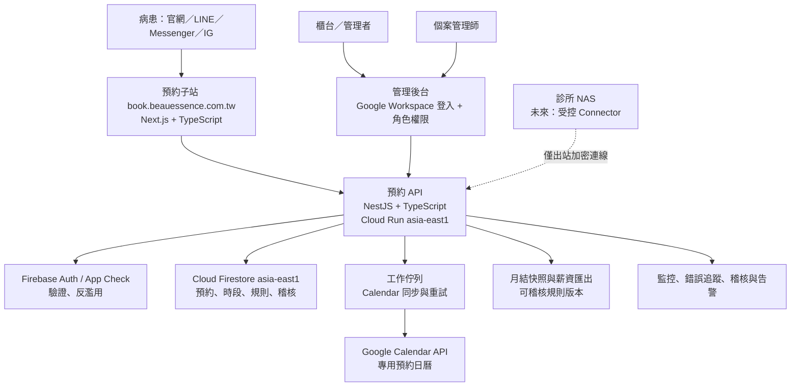

# 一森渼診所企業級預約平台專案規劃書

**版本：** 1.4  
**日期：** 2026-07-21  
**適用對象：** 一森渼診所（Beau Essence）  
**定位：** 先以網站與 Firebase/Firestore 試營運，通過驗證後平順升級為正式商用平台，並保留原生 Android、iOS App 與診所 NAS 串接能力。

---

> **2026-07-23 實作補充：** 本文件保留完整 programme 背景；目前施工順序以
> [正式化後續實作規劃書](product/production-readiness-delivery-plan-2026-07-23.md)
> 為準，技術邊界以
> [正式環境目標架構書](architecture/production-target-architecture-2026-07-23.md)
> 為準，現況證據見
> [企業級上線前審查](reviews/2026-07-23-enterprise-production-readiness-review.md)。
> 三者均不自行核准 D-001～D-011。

## 1. 執行摘要

診所目前從官網、LINE 官方帳號、Facebook Messenger 與 Instagram 收到預約或諮詢訊息，再由櫃台人工填入 Google Calendar。這種流程會造成跨平台切換、晚間漏接、時段衝突與人工追蹤成本。

本專案建立獨立的預約子站，例如 `book.beauessence.com.tw`。病患在網站直接選擇服務、醫師/資源、日期與時段；系統以 Firestore 的原子交易保留時段，再非同步且可重試地同步至 Google Calendar。取消預約也由同一套流程處理。Google Calendar 是櫃台的工作檢視與同步目標，不作為防止雙約的唯一資料來源。

首期不使用簡訊通知、不處理病歷、診斷、付款或病患影像。先完成可靠的網頁預約、取消、後台、日曆同步，以及「看診完成後指派個案管理師、月度案件統計與薪資計算單位匯出」，再逐步接入 LINE、Messenger、Instagram、原生 App 與 NAS。

**核心原則：**

- 商用正式架構，不以免費方案或個人用途服務承擔營運風險。
- 所有預約規則只在一個後端領域模組實作；網站、社群與未來 App 都呼叫同一組 API。
- 病患端不直接寫入 Firestore；預約、取消、權限與稽核均由伺服器端處理。
- 使用最少必要個資；不將病患電話、諮詢內容或醫療資訊放入 Google Calendar 標題或描述。
- 每一個外部呼叫都可追蹤、可重試、可人工補救，且不會重複建立日曆事件。

### 1.1 專案目前狀態（2026-07-21）

Phase 0 已完成，Phase 1 目前為「決策待核准、僅限合成資料測試」狀態。
已驗證預約防撞、冪等、取消期限、到診完成權限、稽核／outbox 以及 Firestore
客戶端預設拒絕規則。2026-07-21 已依專案負責人指示建立獨立 Firebase 專案
`beauessence-clinic-staging`，但只部署七天到期的靜態 Hosting 預覽；資料只保存在
目前瀏覽器的 `localStorage`。未啟用雲端資料庫、後端、身分驗證、Google Calendar、
NAS 或任何真實病患／薪資資料連線，也未部署 Hosting live channel。

診所的 D-001～D-011 正式決策仍為待定。測試使用的服務、時段、取消期限與角色
均為不可用於營運的合成 fixtures；正式開發與試營運前，須由診所依專案內的核准包
填入實際答案、責任人與核准日期。

2026-07-21 另完成一次程式庫全面檢查與修正，內容見
[Codebase analysis and remediation](reviews/codebase-analysis-and-remediation-2026-07-21.md)。
重點是專案在此之前**沒有版本控制**（已建立 Git 並保留完整歷史）、test-only API
的 loopback 邊界可被環境變數繞過（已改為硬性拒絕）、權限解析在 session 失效時
會回退為管理者（已改為 fail-closed），以及本機測試網站的 CSP 擋掉自己的管理
介面（已修正並實機驗證）。

工程基礎設施仍有已知缺口，見 §5.3。這些缺口不影響目前的合成測試，但在 Phase 1.5
正式加固前必須補齊。

---

## 2. 現況與目標

### 2.1 已確認現況

依現有官網的「線上諮詢」頁面，表單目前收集姓名、性別、年齡、手機、方便聯繫時間與諮詢問題，並連結至 LINE、Instagram、Facebook 等既有通路。這是諮詢蒐集流程，尚非可自行選取時段、可取消且能防雙約的預約系統。

現有官網維持行銷與內容角色。新平台以獨立子站上線，官網、LINE、Messenger、IG 先統一導向預約子站；此做法可降低首期社群 API 審核與多通路同步的複雜度，也不影響既有網站。

### 2.2 專案目標

1. 病患可在行動裝置與桌面瀏覽器完成自助預約與取消。
2. 預約建立與取消後，自動同步至指定 Google Calendar。
3. 同一醫師/療程資源/時段不得產生兩筆有效預約。
4. 櫃台可在後台管理班表、休診、預約、取消與人工新增。
5. 後台變更與系統操作可稽核；Google Calendar 同步失敗可重試與人工處理。
6. 以單一、文件化的 API 與資料模型支援未來 Android、iOS、社群與 NAS 整合。
7. 依可設定且可追溯的規則，統計每位個案管理師在每月實際完成看診的案件數，供薪資作業覆核與匯出。

### 2.3 首期不納入範圍

- 簡訊驗證、簡訊提醒與簡訊行銷。
- 線上付款、療程/手術定金、電子發票。
- 病歷、診斷、病史、術前術後照片、影像檔與醫囑。
- 個案管理師的醫療評估或醫療處置紀錄；首期僅保存指派關係、聯繫/服務作業狀態與經核准的薪資計算單位。
- 由 AI 自動判定醫療適應症或提供醫療建議。
- 將既有 LINE、Messenger、IG 私訊歷史批次匯入。
- NAS 的直接公開連線或將 NAS 暴露於網際網路。

---

## 3. 目標使用流程

### 3.1 病患預約

1. 病患從官網、社群連結或直接網址進入預約子站。
2. 選擇諮詢/療程類別、醫師或資源、日期與可用時段。
3. 填寫最少必要資料：姓名、手機、Email、聯繫偏好；確認隱私告知與預約規則。
4. 系統進行人機驗證、速率限制與 Email 驗證。首期不使用 SMS。
5. 後端在 Firestore 交易中鎖定時段並建立預約；成功後回傳預約編號與取消連結。
6. 病患頁面顯示「預約已成立；日曆同步處理中/已完成」的真實狀態。背景工作建立對應 Google Calendar 事件；若失敗，保留在待處理佇列，依退避策略重試並在後台顯示，且不把未同步誤標為成功。

### 3.2 病患取消

1. 病患由預約確認頁或 Email 內的短效、一次性取消連結進入。
2. 系統依診所規則檢查可取消期限。
3. Firestore 交易將預約改為 `cancelled`、釋出時段並記錄稽核事件。
4. 背景工作刪除或標記 Google Calendar 對應事件；失敗時可安全重試。

### 3.3 櫃台與管理者

- 以公司管理帳號登入後台，不與病患帳號混用。
- 可查看日、週預約；管理班表、休診、封鎖時段與療程時長。
- 可人工建立、改期、取消及標記未到；每次動作均有操作者、時間、前後狀態與原因。
- 僅由後台或正式 API 改動預約。櫃台不應直接在 Google Calendar 新增、刪除或改期。

### 3.4 個案管理師與月度薪資計算

病患完成到診後，櫃台或具權限的管理者將預約標記為 `completed`，再由系統建立或確認個案管理師指派。計薪不以「預約建立數」或「私訊數」計算，而以診所簽核的 `completed` 到診事件為唯一依據，排除取消、爽約、重複點擊與尚未到診的預約。

首期建議的預設計算口徑是：**同一位病患在同一薪資月份，首次完成符合資格的看診，對當時有效指派的個案管理師產生一個計薪案件單位。** 回診是否另計、不同療程權重、共同服務拆分與新客/舊客認定，均設為可版本化的診所薪資規則，不寫死在程式裡。

月結流程：

1. 系統在每月結算日前產生「暫計」案件清單，列出個管、病患代碼、完成日期、適用規則與計薪單位。
2. 主管覆核未指派、改派、取消、更正與例外項目；任何人工調整都必須填寫原因與附件/備註索引。
3. 薪資管理者核准後鎖定當月快照，匯出 CSV/Excel 給薪資系統。
4. 鎖定後不回寫歷史計算；事後更正以可追溯的 `adjustment` 調整項處理。

個案管理師只能查看自己被指派的病患與工作清單；月薪、單價、其他個管案件數與調整權限只開放給薪資管理者與主管。

---

## 4. 建議技術架構



### 4.1 技術選型

| 層級 | 建議 | 原因 |
|---|---|---|
| 病患預約站與後台 | Next.js + TypeScript | SEO、行動版、元件化與主流人才供給兼顧；同一語言降低交接成本。 |
| 業務 API | NestJS + TypeScript（Fastify adapter） | 明確的模組、驗證、Guard、測試與 OpenAPI 文件結構，適合多人維護。 |
| 資料庫 | Cloud Firestore，區域選 `asia-east1` | 首期符合 Firebase 試營運需求，並可選臺灣區域；所有資料存取經 API。 |
| 執行環境 | Google Cloud Run，區域選 `asia-east1` | 商用受支援、可分環境部署、可使用服務帳號與監控；不依賴 Vercel Hobby。 |
| 背景工作 | 受控工作佇列 + Worker | 將 Google Calendar、Email 與未來社群呼叫從同步預約請求分離，支援重試與死信處理。 |
| 身份與防護 | Firebase Auth、App Check、後端速率限制與 WAF | 管理者與病患的驗證分流，降低機器人預約與 API 濫用。 |
| 機密管理 | Google Cloud Secret Manager + 最小權限服務帳號 | 不將憑證、API key 或私鑰放進程式碼、前端或 `.env` 檔。 |
| CI/CD 與程式治理 | GitHub、GitHub Actions、PR 審查、測試門檻 | 每次部署可追溯、可回滾，且維護方式一致。 |

Cloud Run 與 Firestore 都可選用 `asia-east1`（臺灣）區域。建立 Firebase 專案時要先確定預設資源位置，因部分 Firebase 服務具有位置相依性；正式環境不可沿用測試專案。

### 4.2 為何不把 Google Calendar 當唯一資料庫

Google Calendar 有建立、刪除事件及監看異動的 API，但它不是跨通路預約的原子鎖定機制。正式設計以 Firestore 的時段鎖定為準，Calendar 作為櫃台作業檢視與同步投影。

- 預約先鎖定 Firestore 時段，再進入同步佇列。
- 每筆預約使用固定的 Calendar Event ID / idempotency key；重試不會產生重複事件。
- 若櫃台必須直接編輯 Google Calendar，Phase 2 才啟用 Calendar `events.watch`、同步 token、頻道到期續訂及定期完整核對。Google 明確指出通知可能遺漏，因此不能只依賴 webhook。
- 首期規範是：班表、封鎖與預約改動一律由後台執行，Google Calendar 不作人工編輯入口。

### 4.3 Google Calendar 授權

建立一個診所專用的「預約作業日曆」，與醫師私人日曆分離。Cloud Run 以專用服務帳號執行，僅授與該日曆所需權限；採用執行環境的服務身分，不散發 Service Account JSON 私鑰。若使用 Google Workspace，應由管理者管理帳號、日曆授權與離職停權。

Calendar 事件標題只放預約編號或最小識別資訊，例如「預約 #A20260720-001」，電話、諮詢內容與其他個資只保留在受權限控管的後台。首期不將病患列為 Calendar attendee，並以 `sendUpdates=none` 方式避免 Calendar 意外寄送 Email；任何病患通知均由經核准的通知模組處理。

---

## 5. 可維護性設計

### 5.1 單一程式庫與清楚邊界

採 monorepo，所有服務使用 TypeScript；禁止把業務規則散落於前端、LINE webhook 與日曆腳本。

目標結構如下。`狀態` 欄反映 2026-07-21 的實際程式庫，避免規劃書被誤讀為
「已經做到」：

| 路徑 | 用途 | 狀態 |
|---|---|---|
| `apps/web/` | 病患預約站與管理後台 | 合成測試介面已建立；正式預約站未建立 |
| `apps/api/` | NestJS API、認證、權限與 OpenAPI | 只暴露 `/v1/health`；預約寫入路徑有 repository 與 Emulator 測試，依 Phase 1 gate 尚未開為路由 |
| `apps/worker/` | Calendar、Email、社群等背景工作 | outbox 處理器已實作：租約領取、指數退避、死信；外部服務以 port 隔離 |
| `packages/domain/` | 預約狀態機、時段規則、純商業邏輯 | 已建立並有測試；建立、五種轉換、改期與 outbox 重試皆為 I/O-free 的純決策 |
| `packages/contracts/` | Zod schema、OpenAPI 型別、錯誤碼 | 已建立 |
| `packages/config/` | 安全設定解析與本機預設值 | 已建立 |
| `packages/ui/` | 共用 UI 元件與設計 token | 尚未建立；目前樣式集中於 `apps/web/public` |
| `infra/terraform/` | 雲端資源、IAM、監控、環境配置 | 僅有 README，尚未撰寫 |
| `tests/` | 跨套件與 Emulator Rules 測試 | 已建立 |
| `scripts/` | 結構、UI 邊界與 Emulator 檢查腳本 | 已建立 |
| `docs/adr/`、`docs/runbooks/` | 架構決策與維運手冊 | 已建立 |

完整文件索引見
[文件索引](README.md)。

### 5.2 開發規約

- 所有 API 以 OpenAPI 3.1 文件與自動產生型別為契約；Android、iOS 不直接讀寫 Firestore。
- 預約狀態機、取消規則、時段演算法集中於 `packages/domain`，以單元測試覆蓋。
- Pull Request 必須通過 lint、型別檢查、單元測試、API contract test、Firestore Rules emulator test 與端對端測試。
- 重要架構選擇以簡短 ADR 記錄「背景、決定、替代方案、後果」，避免日後只能靠口頭交接。
- `main` 分支永遠可部署；測試、預備、正式環境使用不同 Firebase 專案、Calendar、服務帳號與資料。

上列為目標規約。**目前只有部分項目有自動化把關**，實際狀態見 §5.3。

### 5.3 規劃與實作落差追蹤

規劃書與程式庫容易隨時間脫節。本節記錄兩者目前的差距，每次階段檢查時更新。

**目前已自動化（`corepack pnpm verify` 一次執行）**

| 檢查 | 內容 |
|---|---|
| 結構檢查 | 必要文件與模組存在，避免被誤刪 |
| UI 邊界檢查 | 介面的權限、無外部端點、欄位允許清單與無障礙基線 |
| 文件檢查 | 所有 markdown 相對連結可解析，且每份文件都登記在 `docs/README.md` |
| 格式檢查 | Prettier（2026-07-21 導入） |
| **Lint** | **ESLint + typescript-eslint，含型別感知規則（2026-07-21 導入）** |
| 型別與建置 | 各 TypeScript 專案 |
| 單元測試 | 領域規則、契約、API 與瀏覽器模組 |
| Rules 測試 | `corepack pnpm test:rules`，本機 Emulator 驗證交易、冪等、outbox 與預設拒絕 |
| **CI** | **`.github/workflows/verify.yml`，於 push 與 PR 執行上列全部檢查** |

Lint 只負責正確性，排版交給 Prettier，兩者不重疊。型別感知規則中最重要的是
`no-floating-promises`：本專案的預約寫入、outbox 重試與瀏覽器互動全是非同步，
漏掉一個 `await` 會靜默失敗而不報錯。

（此表刻意不記錄檔案數或測試數：寫死的數字必然過期，正是本節要避免的問題。
實際數量以 `corepack pnpm verify` 的輸出為準。）

**已知缺口**

| 缺口 | 影響 | 建議補齊時點 |
|---|---|---|
| ~~無 CI~~ | 已於 2026-07-21 補齊 | ✅ |
| ~~無 ESLint~~ | 已於 2026-07-21 補齊 | ✅ |
| ~~`apps/worker/` 僅有 README~~ | outbox 處理器已實作並以 Emulator 驗證 | ✅ |
| **瀏覽器與伺服器是兩份領域規則** | `apps/web/public/modules/` 與 `packages/domain/` 各自實作同一套規則，會隨時間漂移 | **目前最大的技術債**；需 `apps/web` 導入建置流程 |
| 無 API contract test 與端對端測試 | §5.2 已列為 PR 門檻，但尚未建立 | 啟用正式寫入路徑前 |
| 無 remote repository | 版本控制只存在單一台機器，無異地備援 | 儘早 |
| `infra/terraform/` 僅有 README | 雲端資源為 Phase 1 完成標準的一部分 | 依 Phase 1 排程 |
| OpenAPI 文件尚未產生 | 契約目前以 `packages/contracts` 的 TypeScript 型別為準 | 對外提供 API 前 |

這些缺口都不影響目前「僅合成資料、無雲端後端」的範圍，但屬於 Phase 1.5
「正式商用加固」完成標準的前置條件。

---

## 6. 資料模型與防雙約

### 6.1 核心集合

| 集合 | 用途 | 關鍵資料 |
|---|---|---|
| `resources` | 醫師、診間、設備或療程資源 | 可預約規則、容量、Calendar ID |
| `availability_rules` | 開診、休息、休診、特殊班表 | 生效時間、優先順序、來源 |
| `slots` | 可預約時段與目前佔用狀態 | resource、start/end、bookingId、version |
| `patients` | 最小化病患主檔，避免每筆預約重複保存聯絡資料 | patientId、已驗證聯絡方式、合併/停用狀態 |
| `patient_cases` | 由完成到診建立的非病歷作業案件 | patientId、來源預約、服務分類、case status |
| `appointments` | 預約主檔與狀態歷史 | patientId、bookingCode、狀態、取消規則 |
| `outbox_jobs` | 可靠外部同步工作 | job type、idempotency key、重試次數、最後錯誤 |
| `calendar_links` | 預約與 Calendar Event 的對照 | appointmentId、calendarId、eventId、sync status |
| `audit_events` | 不可覆寫的操作稽核 | actor、action、target、before/after 摘要、時間 |
| `case_managers` | 個案管理師帳號與可服務範圍 | userId、active、role、服務類別 |
| `case_assignments` | 病患案件與個管的有效指派歷程 | patientCaseId、managerId、effectiveFrom/To、assignedBy、reason |
| `payroll_rules` | 可版本化的計薪案件規則 | ruleVersion、適用條件、計算方式、生效日 |
| `payroll_credits` | 每一筆可計薪案件/調整的不可覆寫帳本 | managerId、patientId、patientCaseId、completedAt、period、ruleVersion、unit、status |
| `payroll_periods` | 月結快照、覆核與鎖定紀錄 | period、status、approvedBy、lockedAt、exportVersion |
| `privacy_policy_versions` | 已發布的隱私政策與告知內容 | version、contentHash、effectiveAt、publishedBy |
| `privacy_acceptances` | 病患對特定版本的閱覽/同意紀錄 | subjectId、policyVersion、acceptedAt、channel、locale |

### 6.2 預約狀態

```text
draft -> pending_verification -> confirmed -> completed
                         └-> expired
confirmed -> cancellation_requested -> cancelled
confirmed -> no_show
```

建立預約時，伺服器對 `slots/{resourceId}_{startAt}` 執行 Firestore Transaction：只有時段未被有效預約佔用時，才同時寫入 `slots`、`appointments` 與 `outbox_jobs`。取消時同樣在交易中改變預約狀態與釋出時段。這保留取消歷史，也避免以「刪除預約文件」處理取消造成稽核缺口。

Google Calendar 呼叫絕不放在 Transaction 內。Firestore Transaction 可能重試；外部呼叫若置入其中，可能重複建立日曆事件或寄出通知。

個案計薪同樣不可只以報表即時計算。每個 `completed` 到診事件依當時有效的 `case_assignment` 與 `payroll_rule` 寫入一筆 `payroll_credit`。預設「每月每病患一次」規則使用 `managerId + patientId + payrollPeriod + metricCode + ruleVersion` 的唯一鍵；若日後啟用「每案件」或「每次到診」規則，才改用對應的案件/到診唯一鍵。月結鎖定後，報表永遠由該月快照讀取，而非依目前的指派關係重算歷史。

所有時間以 UTC 儲存、以 `Asia/Taipei` 顯示與結算；薪資月份依臺北時區的月曆界線判定。病患主檔不得以姓名自動合併；電話/Email 相符僅提示管理者，由具權限人員執行可稽核的人工合併，避免誤併個資與薪資案件。

---

## 7. 資安、個資與網站治理

本平台是預約與聯絡資料系統，而非電子病歷系統；但資料仍可能揭露就醫關聯，應以高敏感個資的風險等級管理。正式上線前應由診所法務或個資顧問確認資料分類、告知事項、委外處理與保存期限。

### 7.1 必要控制

- 病患端：HTTPS、Content Security Policy、HTTP security headers、速率限制、人機驗證、App Check、短效取消 token。
- 後台：Google Workspace/企業帳號登入、強制 MFA、角色權限（櫃台/主管/系統管理者）、閒置登出與完整稽核。
- API：驗證 Firebase ID token、後端角色授權、Zod 欄位白名單、輸入驗證、重放防護與 per-IP/per-account 限流。
- Firestore：預設拒絕；病患端不直接寫預約資料。注意伺服器 SDK 會繞過 Firestore Security Rules，因此 API 本身必須完成所有授權與驗證。
- 機密：Secret Manager、服務帳號最小權限、定期輪替、禁止在 Git、瀏覽器、日曆描述或錯誤日誌留下機密與完整個資。
- 日誌：記錄操作與錯誤碼，不記錄完整姓名、手機、Email、諮詢內容、token 或 webhook 原始敏感內容。

### 7.2 病患隱私政策、個資告知與同意紀錄

預約表單送出前必須以可閱讀的摘要顯示個資蒐集告知，並連至完整隱私權政策；病患勾選「已閱讀」後才可送出。系統保存告知版本、內容雜湊、時間、語言與提交通路，讓日後可證明病患看到的是哪一版內容。此勾選是預約必要資料的告知確認，**不得與行銷同意綁定**；行銷、回診促銷或跨通路再行銷需使用獨立、預設不勾選且可隨時撤回的選項。

正式隱私權政策至少應明確載明：

1. 資料蒐集者名稱、聯絡方式與個資聯絡窗口。
2. 蒐集目的：預約安排、就診聯繫、取消/改期、指定個案管理師之必要追蹤與系統安全；不以預約資料自動進行行銷。
3. 資料類別與最小化原則：姓名、電話、Email、預約時段、服務類別、指派關係及必要操作紀錄；預約頁不蒐集病史、診斷、影像或自由填寫的敏感醫療問題。
4. 利用期間、地區、對象與方式；包括診所授權人員及受監督的雲端服務供應商。資料區域與跨境處理應依實際部署、合約與法務檢視後如實揭露。
5. 當事人的查詢、閱覽、複製、更正、停止蒐集/處理/利用及刪除等權利與申請方式。
6. 不提供必要資料的影響，例如無法完成線上預約或無法寄送取消驗證連結。
7. 保存、刪除、備份、資安事件聯繫、政策生效日與版本歷程。

個案管理師對病患資料的存取目的限於被指派案件的預約/服務追蹤，不得將聯絡資料匯出、私下保存或作未經同意的行銷。隱私政策、個資告知、委外處理條款與薪資資料使用範圍，應在上線前由診所法務或個資顧問完成最終審核。

### 7.3 資料保存、備份與復原

正式環境需設定自動備份、復原演練與保留期限；Firestore 的備份/還原類功能須以已啟用計費的專案規劃，不可假設免費層即可滿足企業復原需求。

初始建議的營運目標，待診所確認後納入 SLA：

- **RPO：** 不超過 24 小時。
- **RTO：** 營運時間內 4 小時恢復預約服務。
- **復原演練：** 每半年至少一次，含日曆同步與取消流程驗證。

---

## 8. 分階段導入計畫

### Phase 0：需求凍結與基礎設計（第 1-2 週）

- 訪談櫃台、醫師與管理者，確認療程、醫師、診間、時段、容量、候補、取消期限及人工例外流程。
- 定義資料最小化欄位、隱私告知、保存期限與角色權限矩陣；完成隱私權政策與個資蒐集告知草案。
- 確認個案管理師指派時點、計薪案件定義、回診計算、改派規則、人工調整權限與月結覆核人。
- 建立使用者流程、畫面原型、設計系統、OpenAPI 初稿與 ADR。
- 建立 dev/staging/production 專案、臺灣區域、IAM、機密管理、CI/CD 與監控基線。

**完成標準：** 診所簽核預約規則、欄位清單、取消政策、後台角色、個管計薪規則、隱私告知草案與 Google Calendar 專用日曆。

### Phase 1：網站 MVP 與 Firebase 試營運（第 3-8 週）

- 建置病患預約、Email 驗證、取消、服務/資源/時段選擇。
- 建置櫃台後台、班表、封鎖時段、人工預約、改期、取消與稽核。
- 建置到診完成、個案管理師指派/改派、個人工作清單、月度案件報表、薪資暫計與核准鎖定流程。
- 實作 Firestore 防雙約、outbox、Google Calendar 建立/取消/重試與同步監控。
- 建置資安控制、測試、自動部署、錯誤告警與維運手冊。
- 以非真實資料完成整合測試後，採受控時段、有限服務項目進行 2-4 週試營運。

**完成標準：**

- 併發預約測試下零雙約。
- Calendar 暫時失敗後可自動恢復或在後台明確呈現待處理。
- 取消後時段可依規則重新釋出，且歷史可追溯。
- 管理者、櫃台、未登入病患的權限測試全部通過。
- 個管月報只計入符合規則的 `completed` 到診，改派與人工調整皆可追溯；鎖定月結可重現匯出結果。
- 既有 Google Calendar 的未來班表與封鎖時段已完成一次性匯入及人工核對。

### Phase 1.5：正式商用加固（第 9-10 週）

- 完成隱私權政策、個資告知、個案管理師存取/委外處理文件檢核、備份設定、復原演練、監控告警與成本預算上限。
- 以一個完整月份的模擬資料驗證個管案件、薪資快照、覆核、鎖定與更正帳本流程。
- 完成資安檢測、弱點修補、壓力測試與 UAT。
- 將現有官網「立即預約」按鈕與 LINE/IG/FB 固定選單統一導向預約子站。

**完成標準：** 通過上線檢核表、診所完成櫃台教育訓練、指定營運負責人與異常處理窗口。

### Phase 2：社群通路深度整合（後續，約 4-6 週）

- LINE：先以 LIFF/預約連結導流；後續再接 webhook、預約查詢與取消引導。
- Messenger/Instagram：先回覆預約子站連結；取得平台必要權限與審核後，再導入 webhook 互動。
- 所有 webhook 都驗證平台簽章、支援重送去重與非同步處理。LINE webhook 必須先驗證 `x-line-signature`，不可只以 IP 白名單判斷來源。

### Phase 3：原生 Android/iOS App（需求驗證後）

- 以既有 OpenAPI、Firebase Auth、領域模組與後端權限為基礎。
- App 僅呈現與呼叫 API；不重新實作時段規則或直接操作資料庫。
- 依需求加入 Push notification、Apple/Google 登入、預約歷史與診所公告；通知同意與偏好必須可管理。

### Phase 4：診所 NAS 整合（需求確認後）

- 定義 NAS 廠牌、DSM/OS、可用 API、資料類型、備份目的與保留政策。
- NAS 只以內網 Agent 或出站 mTLS/HTTPS Connector 與雲端溝通；禁止開放 NAS 管理介面或 SMB/NFS 到公網。
- 初期僅同步經核准的匯出/備份，不直接把 NAS 當成線上交易資料庫。
- 導入前完成網路分段、權限、加密、復原演練與資安評估。

---

## 9. 測試與上線驗收

| 類型 | 驗證項目 |
|---|---|
| 單元測試 | 時段生成、時區、取消規則、狀態機、費用/療程規則（如有） |
| 併發測試 | 同一時段大量同時預約，只允許一筆有效預約 |
| 整合測試 | Google Calendar 新增、取消、逾時、5xx、重試、冪等處理 |
| 權限測試 | 病患不可讀他人資料；櫃台與管理者僅能執行授權操作 |
| 安全測試 | XSS、CSRF、注入、越權、token 重放、Webhook 偽造、暴力預約 |
| 隱私測試 | 告知版本留存、行銷同意獨立性、個資匯出/刪除申請流程、日誌遮罩與個管最小權限 |
| 薪資規則測試 | 完成到診才計入、同月同病患去重、改派、回診、人工調整、鎖定月結與下月調整 |
| 端對端測試 | 預約、改期、取消、休診、人工建檔、日曆同步、後台稽核 |
| 復原測試 | 備份還原、Calendar 同步回補、工作佇列失敗重送 |
| 使用者驗收 | 櫃台在尖峰情境完成預約與例外處理，流程與現場 SOP 一致 |

正式上線前需執行一次「Google Calendar 不可用」演練：病患不應看到不存在的成功狀態；系統必須保留待同步工作、告警管理者，並能在服務恢復後安全回補。

---

## 10. 維運、成本與責任分工

### 10.1 成本原則

本案以企業級可維護性與可復原性為目標，需使用商用帳務專案，而非以免費額度作為正式服務承諾。正式預算應拆分為：

- 網域/DNS、Cloud Run、Firestore、背景工作、日誌、監控、WAF、Secret Manager、備份與資料傳輸。
- Google Workspace/Calendar 帳號與必要的企業帳號管理。
- Email（若啟用交易 Email；不含 SMS）。
- 開發、資安檢測、維護、上線支援與定期復原演練。

在 Phase 0 取得實際日預約量、時段數、Google Calendar 數量、保存年限與 NAS 型號後，再提出月營運預算與預算上限；此規劃書不以不穩定的免費配額估算商用成本。

### 10.2 角色

| 角色 | 職責 |
|---|---|
| 診所產品負責人 | 預約規則、服務項目、取消政策、最終驗收與優先順序 |
| 櫃台代表 | 現場 SOP、例外情境、UAT 與教育訓練 |
| 個案管理師主管 | 指派規則、案件完成定義、月度案件覆核與改派審核 |
| 薪資管理者 | 薪資規則版本、月結快照核准、匯出與調整權限 |
| 技術負責人 | 架構、資安、程式品質、發布、維運文件與交接 |
| 開發團隊 | 前後端、測試、CI/CD、API 文件與缺陷修正 |
| 法務/個資顧問 | 個資告知、委外條款、保存與資料主體權利流程確認 |

---

## 11. 上線前必須確認的決策

1. 可預約的服務、醫師、診間/設備、每種服務時長、緩衝時間與每日容量。
2. 病患是否必須登入；首期建議 Email 驗證後預約，管理者採企業帳號登入。
3. 取消、改期、候補、遲到與未到的作業規則。
4. Google Calendar 是否允許櫃台直接人工編輯；建議首期否。
5. 正式資料保存年限、備份 RPO/RTO、是否需要資料落地於 NAS。
6. 現有 Google Calendar 班表與未來預約的匯入範圍、清理方式與切換日期。
7. 視覺品牌、網址、隱私權政策、Cookie 政策與預約條款的最終文字。
8. Phase 2 是否只做社群導流，或要投入平台 API 審核與雙向訊息自動化。
9. 個管計薪定義：以新客、每次完成看診、療程階段或其他單位計算；回診、共同服務與轉派如何計算。
10. 月結週期、覆核截止日、鎖定權限、薪資匯出格式與鎖定後更正的調整流程。
11. 個案管理師可見的資料欄位、可聯繫期限，以及離職/調職時的立即停權與案件轉派 SOP。

---

## 12. 專案啟動與最終審查

已建立文件優先的專案骨架：[`beauessence-appointment-platform`](../)。啟動前的詳細比較、已排除風險、剩餘阻擋項目與新增上線門檻，請見：[Implementation Readiness Review](reviews/2026-07-20-implementation-readiness-review.md)。

目前已完成的檢查點與證據（新到舊）：

| 日期 | 檢查 | 結果 |
|---|---|---|
| 2026-07-21 | [程式庫分析與修正](reviews/codebase-analysis-and-remediation-2026-07-21.md) | 建立版本控制；修正 loopback、權限、CSP 與排版把關缺口 |
| 2026-07-21 | [管理工作臺流程分析與修正](reviews/manager-workflow-analysis-and-remediation-2026-07-21.md) | 工作臺改為可執行的日常順序 |
| 2026-07-21 | [線上合成預覽檢查點](reviews/phase-1-synthetic-online-preview-checkpoint-2026-07-21.md) | 到期靜態預覽、安全標頭與瀏覽器驗證 |
| 2026-07-20 | [合成個管工作量檢查點](reviews/phase-1-synthetic-case-workload-checkpoint-2026-07-20.md) | 非金額的工作量彙總驗證 |
| 2026-07-20 | [本機合成測試檢查點](reviews/phase-1-test-only-checkpoint-2026-07-20.md) | 預約、冪等、稽核／outbox 與預設拒絕 |
| 2026-07-20 | [Phase 1 入口檢查點](reviews/phase-1-entry-checkpoint-2026-07-20.md) | Phase 0 完成，進入僅本機模式 |

完整文件索引見
[文件索引](README.md)。

下一個受控動作是需求簽核；在決策登錄中的阻擋決策、正式隱私政策及存取權限未完成前，
除已記錄的靜態合成預覽外，不得建立雲端後端、開啟正式預約或寫入真實病患／薪資資料。

---

## 13. 官方規格與參考資料（查核日：2026-07-20）

- 現有官網「線上諮詢」頁面：[Beau Essence 線上諮詢](https://beauessence.com.tw/reservations/)
- Firestore 資料位置與 `asia-east1`：[Cloud Firestore locations](https://firebase.google.com/docs/firestore/locations)
- Firebase 專案資源位置相依性：[Firebase locations](https://firebase.google.com/docs/projects/locations)
- Cloud Run 臺灣區域與服務資料位置：[Cloud Run locations](https://cloud.google.com/run/docs/locations)
- Firestore Security Rules 與測試：[Firebase Security Rules](https://firebase.google.com/docs/rules)
- 伺服器 SDK 會繞過 Firestore Rules：[Securely query data](https://firebase.google.com/docs/firestore/security/rules-query)
- App Check 保護自訂後端：[Verify App Check tokens](https://firebase.google.com/docs/app-check/custom-resource-backend)
- Google Calendar 事件建立與固定 Event ID 的冪等設計：[Create events](https://developers.google.com/workspace/calendar/api/guides/create-events)
- Google Calendar 事件刪除與授權範圍：[Events: delete](https://developers.google.com/workspace/calendar/api/v3/reference/events/delete)
- Google Calendar 變更通知、頻道到期與遺漏通知處理：[Push notifications](https://developers.google.com/workspace/calendar/api/guides/push)
- Google Calendar 增量同步：[Synchronize resources efficiently](https://developers.google.com/workspace/calendar/api/guides/sync)
- Google 服務帳號伺服器對伺服器授權：[OAuth 2.0 for Server to Server Applications](https://developers.google.com/identity/protocols/oauth2/service-account)
- LINE webhook 簽章驗證：[Verify webhook signature](https://developers.line.biz/en/docs/messaging-api/verify-webhook-signature/)
- 衛福部基層醫療院所資安參考資料：[基層醫療院所資安防護參考指引](https://www.mohw.gov.tw/dl-70732-e0d1e6cd-b91d-4f99-8719-d5c4ece2168f.html)
- 個資蒐集告知事項（個資法第 8 條）：[法務部主管法規查詢系統](https://mojlaw.moj.gov.tw/NewsContentE.aspx?id=29&lan=C)
- 醫療個資與受託處理的定義/監督參考：[個人資料保護法施行細則](https://srsch.mohw.gov.tw/FileDownLoad/FileUpload/20250724094428919539.pdf)
