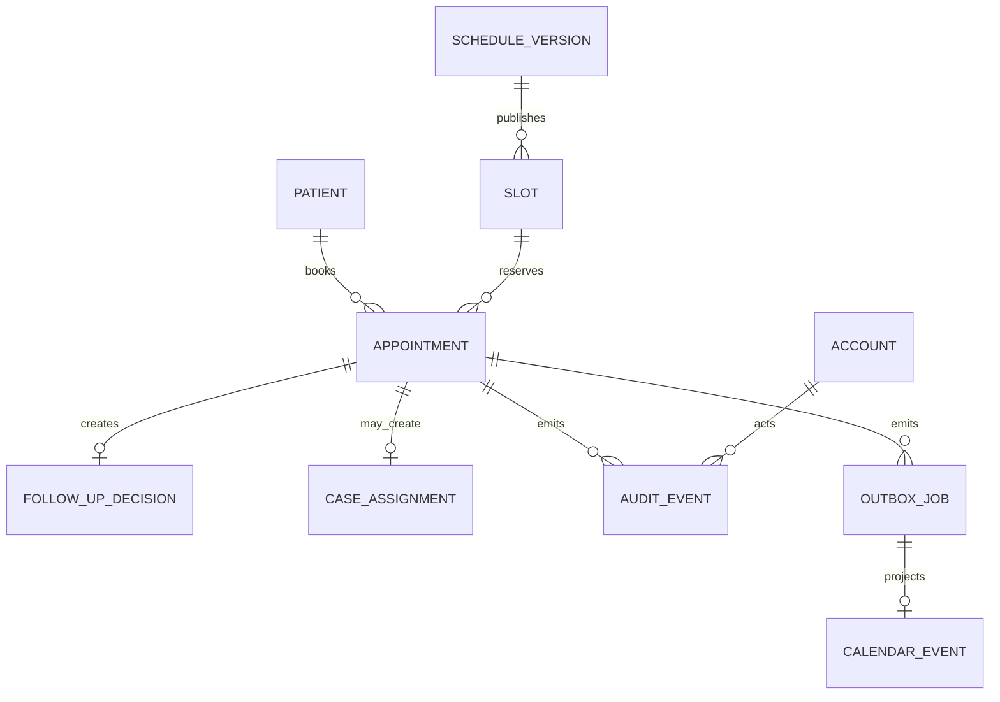
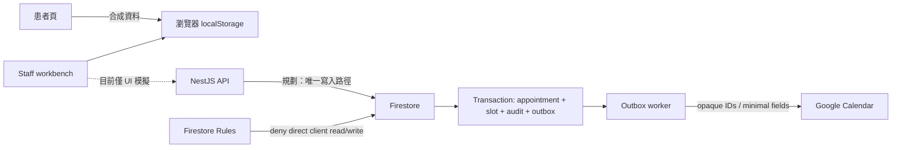

# 2026 醫療診所企業級上線前審查報告

- 審查日期：2026-07-23（Asia/Taipei）
- 審查基準：`F:\診所專案\beauessence-appointment-platform`
- Git 基準：`dece1c4`（審查結束時工作樹乾淨）
- 審查提示詞：`D:\wayde.fu_Data\Downloads\2026 醫療診所企業級上線前審查.docx`
- 線上驗證：`https://beauessence-clinic-staging--synthetic-review-gpt86j36.web.app/`
- 結論適用範圍：目前程式碼、目前合成資料 preview 與可見的 Firebase Hosting staging；不等同法律意見、滲透測試、正式雲端架構審查或真實輔具認證。
- 後續施工依據：[正式化後續實作規劃書](../product/production-readiness-delivery-plan-2026-07-23.md)
- 目標技術架構：[正式環境目標架構書](../architecture/production-target-architecture-2026-07-23.md)

## A. Executive Summary

### 結論

**目前不適合處理真實病患資料或正式對外營運；適合繼續作為合成資料 UI、領域規則與 Firestore Emulator 的展示／驗證環境。**

核心原因不是 UI 品質，而是專案刻意停在 Phase 1 的安全閘門前：D-001～D-011 全部仍為 `pending`，API 只開放 `/v1/health`，登入、伺服器端授權、正式預約端點、資料治理、雲端環境、備份與監控尚未落地。這些是正式上線的必要條件，不能由前端角色切換或文件警語替代。

### 已確認的優點

1. 領域層已建立預約交易、狀態轉換、冪等、slot capacity、audit/outbox 同交易模型；Firestore Emulator 另有競態與 lost-ACK 測試。
2. Firestore Rules 對直接瀏覽器讀寫採 deny-by-default，正式寫入邊界被明確保留給 API。
3. Calendar worker 使用固定 idempotency key、lease、retry/dead-letter 模型，投影資料以 opaque ID 為主，未把病患姓名／電話寫入診所 Calendar。
4. staging 有 CSP、HSTS、`nosniff`、`DENY`、`no-referrer`、Permissions-Policy 與 `noindex`。
5. 實測患者預約、後台篩選、角色切換、清除資料與跨頁狀態一致；320～2560 px 無頁面水平溢位，表單標籤、landmark、skip link、焦點移動與錯誤提示基礎良好。
6. 程式結構、文件索引、格式、lint、types、domain vendor 同步與單元測試已有完整自動檢查。

### 最高風險

1. **沒有正式 Authentication／Authorization。** `/` 是公開 staff workbench，任何取得網址的人都能進入，角色只是瀏覽器內的合成切換。
2. **公開患者頁會把姓名、電話、生日、身分證字號存入 localStorage。** 雖然頁面有合成資料警語、清單遮罩身分證且未傳至伺服器，若訪客誤填真資料，仍會在共享裝置持續保存。
3. **正式 Booking API 不存在。** 現有 API 只有 health；rate limit、anti-automation、真正 actor、server-side validation、病患本人存取與 maintenance enforcement 尚未形成可驗證邊界。
4. **D-001～D-011 全部未核准。** 包含合法依據、保存與刪除、供應商／資料區域、排班與取消政策、角色權限、Calendar、IAM、備份、監控、公開 URL 與人工備援。
5. **正式營運基礎設施與復原能力尚未實作。** `infra/terraform` 只有說明占位，未看到 production project、least-privilege IAM、backup/restore drill、RTO/RPO、告警與 incident response 的可執行證據。

### 評分

各分項等權平均，四捨五入後為整體成熟度；「功能多」不會抵銷醫療資料治理與存取控制缺口。

| 面向 | 分數 / 100 | 評分依據 |
|---|---:|---|
| Overall Maturity | **65** | 下列九項等權平均 |
| Production Readiness | **31** | 合成 preview 可用，但 7 個 P1 gate 尚未解除 |
| Security | **63** | 邊界設計、CSP、Rules 良好；正式身分、API guard、abuse controls 未實作 |
| Privacy | **35** | Calendar 最小化良好；敏感欄位 localStorage、政策／保存／權利流程未核准 |
| Accessibility | **72** | 語意與 reflow 實測良好；未完成 axe、screen reader、forced-colors 與真機矩陣 |
| Performance | **76** | 靜態資產小；未有 CWV/Lighthouse budget，全部 `no-store` 不適合正式快取 |
| Reliability | **68** | 交易、競態與 outbox 測試強；無 production 監控、備份／還原與 jitter |
| UX | **80** | 主流程清楚、錯誤與空狀態良好；仍是工程 preview，無正式 fallback／support |
| Maintainability | **84** | monorepo、共享 domain、ADR、runbook、lint/types/tests 完整 |
| Test Coverage Confidence | **76** | 124 unit + 45 Emulator tests；缺真實 E2E、a11y、效能、備份與多瀏覽器 CI |

## B. System Map

### 頁面、路由與 API

| 路徑／入口 | 主要角色 | 目前行為 | 資料讀寫 | 未授權行為 |
|---|---|---|---|---|
| `/` | 合成管理者、合成櫃台 | 營運首頁、預約、排班、個案、帳號、公告、稽核 | 整份 browser-local state | 沒有登入頁；取得網址即可開啟，僅以 UI 隱藏功能 |
| `/patient.html` | 患者／訪客 | 初診／回診、服務、日期時段、個資、同意、確認、取消 | localStorage；不送伺服器 | 沒有病患身分驗證；只能看同一瀏覽器內的紀錄 |
| `#overview` | 管理者、櫃台 | 摘要與待辦 | localStorage | 前端角色模擬 |
| `#appointments-section` | 管理者、櫃台 | 篩選、取消、完成、no-show、改期、備註 | localStorage | 前端角色模擬 |
| `#schedule-section` | 管理者 | 週排班、例外、草稿／發布 | localStorage | 櫃台 UI 隱藏；沒有 server read/write scope |
| `#case-section` | 管理者 | 回診決定、個管指派、統計 | localStorage | 沒有獨立 Case Manager 角色 |
| `#accounts-section` | 管理者 | 合成帳號啟停 | localStorage | 沒有 IdP、MFA、session revocation |
| `#communications-section` | 管理者 | 公告、maintenance、release、Calendar 模擬 | localStorage | maintenance 不是後端閘門 |
| `#audit-section` | 管理者、櫃台 | 合成 audit list | localStorage，可被使用者清除／修改 | 沒有 append-only server store |
| `/v1/health` | 運維／監控 | health contract | 無病患資料 | 唯一已路由 API |
| 任意不存在路徑 | 所有人 | Firebase 一般 404 | 無 | 沒有品牌化 recovery |

未發現正式 login、logout、unauthorized、forbidden、error、maintenance route、booking write route 或 admin deep-link router。

### 主要實體與關係

另有 Schedule Draft、日期例外、Announcement、Maintenance、Release record。`Visit` 目前是 Appointment 的 `completed` 狀態，不是獨立實體。Patient 缺正式 retention、deletion status、policy acceptance history、merge lineage 與 subject-access-request metadata。

### 資料流與信任邊界

目前線上 preview 只走左側 localStorage；右側 API/Firestore/Calendar 是程式與 Emulator 層的準備，尚不是正式可用的端到端路徑。

### 生命週期與競態

- Appointment：`confirmed → cancellation_requested → cancelled`，或 `confirmed → completed / no_show`。
- Reschedule：交易內釋放舊 slot、保留新 slot、維持 confirmed，並寫 audit/outbox/idempotency。
- Booking transaction：先檢查 idempotency，再檢查 slot 與 active capacity，最後同交易建立 appointment、reservation、audit、outbox、idempotency。
- Outbox：`pending → in_progress → completed`；retryable failure 回 pending，超過上限或 non-retryable 進 dead letter；worker 有 lease recovery。
- Preview 的 schedule publish 只在單一 localStorage state 複製 draft 並遞增 version，不等同多管理員 server concurrency control。

## C. Production Blockers

| Blocker | 嚴重度 | 為何阻擋正式上線 | 解除條件 |
|---|---|---|---|
| 正式 Authentication／Authorization 缺失 | P1 | 內部工作臺公開；actor 與 role 可由瀏覽器狀態決定 | D-006 核准；IdP/MFA/session；API resource/action guard；401/403/BOLA 測試 |
| Privacy／資料治理未核准 | P1 | D-001～D-003 未完成，無合法依據、正式政策、保存刪除、權利請求與供應商紀錄 | 核准決策、版本化 policy acceptance、retention/deletion/DSR workflow |
| 敏感資料 browser-local persistence | P1 | 誤填真資料會留在共享裝置；無 server-side retention、revoke 或 subject rights | preview 限定合成資料／自動到期；正式資料改走核准的加密後端 |
| Booking API 與 abuse controls 缺失 | P1 | 目前只有 `/v1/health`，無可驗證的 server validation、rate limit、anti-bot 與 maintenance guard | 完成受驗證端點、idempotency、rate limit/App Check/CAPTCHA 策略與負面測試 |
| 排班發布的正式版本控制缺失 | P1 | localStorage 版本無法防多管理員覆寫，也沒有 immutable history／diff／rollback | server transaction + revision/ETag + approval + conflict UI + rollback |
| Audit 不足且 preview 可變更 | P1 | 正式事件缺 role、before、after、reason、result、correlation/source 等欄位 | append-only audit store、完整 schema、查詢／匯出與 retention policy |
| Production infra／IAM／backup／observability 缺失 | P1 | Terraform 只有 placeholder，無還原證據、告警、RTO/RPO、IR owner | D-010 核准；IaC review；least privilege；restore drill；SLO/alerts/runbook |

## D. Issue Register

| ID | Severity | Area | Finding / Evidence | Impact | Recommended Fix | Verification | Effort | Blocker |
|---|---|---|---|---|---|---|---|---|
| AUTH-001 | P1 | `/`, API | `permissions.js` 只有 admin/front_desk browser role；`store.js` 明註 production actor 必須來自 authenticated session；API 只路由 health | 未授權存取、水平／垂直越權 | IdP + MFA；HttpOnly session/token；server-side role/resource guards；default deny | 未登入 401、跨病患 BOLA 403、被停權 session 失效、直接 API 測試 | XL | 是 |
| PRIV-001 | P1 | 全站 | `docs/product/phase-1-decision-register.md:9-19` 顯示 D-001～D-011 全 pending | 無法證明合法收集、保存、刪除、委外與公開營運依據 | 由具名 owner 完成核准、日期、證據與版本化決策 | 審查決策登錄、政策發布、同意紀錄與 DSR 演練 | L | 是 |
| PRIV-002 | P1 | Patient / workbench | `state-schema.js:152-167` 把整份 state 存 localStorage；實測可保存姓名、電話、生日、身分證 | 共享裝置殘留、使用者無法由診所中央刪除、誤用真資料 | preview 改為 synthetic-only seed 或 session/TTL；離頁／閒置清除；正式走核准後端與 retention job | 關閉／逾時／共享裝置測試；storage inspection；刪除與 DSR E2E | M + 架構 | 是 |
| API-001 | P1 | API / booking | `app.module.ts:6-12` 明確只暴露 `/v1/health`，booking repository 尚未掛 controller | 正式預約、取消、改期無可信任寫入邊界 | 先核准 D-001～D-006，再建立 contracts/Zod、auth、idempotency、rate limit、maintenance guard | schema fuzz、429、409 capacity、duplicate request、unauthorized direct call | XL | 是 |
| DATA-001 | P1 | Schedule publish | `store.js:102-120` 只複製本機 draft、遞增版本；無 server compare-and-set | 多管理員 lost update、錯排、無安全回復 | immutable schedule versions、revision/ETag、transaction publish、diff/impact review、rollback | 兩管理員同時發布只准一方成功；回滾恢復 slots；既有預約不被孤立 | XL | 是 |
| AUD-001 | P1 | Domain / audit | audit event 目前主要欄位為 id/action/appointmentId/actorId/occurredAt；preview audit 可被 localStorage 修改或清除 | 難以事件重建、責任歸屬與事故調查 | 加入 actor role、before/after、reason、result、correlationId、source、policyVersion；append-only 與限制刪除 | 每個敏感操作有一筆不可改事件；抽樣重建完整時間線 | L | 是 |
| OPS-001 | P1 | Infra / operations | `infra/terraform/README.md` 仍是 scaffold；未見 production resources、backup/restore、SLO alerts | 故障後不可預測，無法證明可復原與可營運 | 建立 dev/staging/prod 隔離、IAM、secret manager、backup、restore drill、IR/RTO/RPO、telemetry | restore drill、權限 review、告警演練、runbook tabletop | XL | 是 |
| TEST-001 | P2 | CI | CI 只執行 verify 與 Firestore rules；無 browser E2E、axe、CWV budget、SAST、secret scan、dependency gate、backup test | UI、輔具、供應鏈與操作性回歸較晚發現 | 新增 Playwright、axe、Lighthouse budget、audit/secret/SAST、artifact retention | PR 故意注入違規案例，確認各 gate 會失敗 | M | 正式 release gate |
| SEC-001 | P2 | Dependencies | `pnpm audit --audit-level=moderate`：3 個 moderate、0 high/critical；含 runtime transitive `uuid` 及 firebase-tools dev chain | 供應鏈風險與未來升級壓力 | 升級 firebase-admin/firebase-tools 或用安全 override；確認相容性與 advisory 可利用性 | audit 歸零或留具名、限期、不可利用的 exception | S–M | 否 |
| REL-001 | P2 | Outbox | exponential retry 為確定性延遲，未見 jitter；未見 production queue depth/dead-letter/lag 指標 | 大規模故障恢復時同步重試、營運無法快速定位 | full jitter、correlation ID、queue age/depth/error-rate metrics、dead-letter alert | 故障注入下重試分散；告警於 SLO 內觸發；runbook 可完成重送 | M | Calendar 上線 gate |
| WEB-001 | P2 | Hosting / recovery | staging 所有資產 `Cache-Control: no-store`；`robots.txt`、`sitemap.xml` 與品牌 404 皆 404 | 正式環境快取效率、搜尋與錯誤復原不足 | 依環境分 headers；hash asset `immutable`，HTML revalidate；正式 robots/sitemap/404 | curl headers、Lighthouse、404 keyboard recovery、production crawl | M | 否 |
| A11Y-001 | P2 | Accessibility | 實測語意與 reflow 良好，但 CSS 未見 forced-colors 規則，CI 無 axe；未以 NVDA/JAWS/VoiceOver 真測 | 輔具／高對比使用者仍可能遭遇未知阻礙 | axe CI、forced-colors 檢查、NVDA/VoiceOver keyboard script、實機 zoom/reflow | 依 WCAG 2.2 AA checklist 留存證據與已知例外 | M | 正式 release gate |
| CAL-001 | P3 | Patient calendar export | 患者下載 `.ics` 只有 DTSTART；Google template 使用相同 start/end。程式註解說明它是「時間點」，診所內部 projection 則有 60 分鐘 | 使用者個人日曆可能顯示為零長度，與診所時段語意不一致 | 由產品確認：若需保留診療區間，使用共用 duration；若刻意為提醒點，於 UI 說明 | iOS/Google/Outlook 匯入矩陣，確認呈現符合產品決策 | S | 否 |
| SEC-002 | P3 | CSP hardening | CSP 已很完整，但未明示 `object-src 'none'`；同源 object 仍落在 default-src | 低機率擴大同源內容執行面 | 加 `object-src 'none'`；評估 `manifest-src`、`worker-src` 最小化 | CSP regression test 與 header snapshot | S | 否 |

未發現 P0。原因是目前沒有 server-side 真實病患資料庫，也沒有證據顯示 staging 已洩漏真實資料；但若把現況誤當正式系統使用，AUTH-001／PRIV-002 可能迅速升級成 P0 事件。

## E. Page / Flow Audit

### 患者預約 `/patient.html`

- 實測完成：初診 → 選服務 → 選日期／時段 → 填合成個資 → 同意 → 建立 `appointment_001`。
- 建立後焦點移到成功標題，預約出現在本機清單；後台摘要與清單同步更新。
- 取消入口使用明確確認對話框；清除資料功能經確認後可清空本機資料。
- name/phone/birth/national ID 有 label、required、`aria-describedby`、`aria-invalid`；電話使用 `type=tel` / `inputmode=tel`，生日使用 date。
- 身分證清單顯示遮罩；後台仍顯示完整電話與生日。這是合成 preview 行為，不可視為正式最小揭露。
- 表單預設 method 是 GET，但欄位無 `name`，JS 攔截 submit，因此實測 URL 未帶 PII；正式版仍應使用 POST API 並禁止 PII 進 query/log。
- maintenance 目前只控制前端狀態。正式版必須由 booking API 同步拒絕寫入。
- Calendar 匯出不包含姓名／電話，但患者個人事件是時間點；需產品決策確認是否符合預期。

### Staff workbench `/`

- 實測摘要、預約篩選、未來合成預約提示、角色切換與前／後台一致性。
- 切換 front desk 後，可見營運首頁、預約與稽核；排班、個案、帳號、公告被 UI 隱藏。
- 這不是安全邊界：整份 state 已在瀏覽器，read scope 沒有 server enforcement。
- 管理者排班發布有受影響預約檢查與版本遞增，但僅限單一 browser state。
- 帳號、公告、maintenance、release、case、audit 均是 synthetic preview，不能證明正式工作流的審批、雙人控制或不可否認性。
- 前台資料預設「今日」篩選會藏起未來預約，但空狀態有說明並可切換全部狀態，沒有形成 dead end。

### API、Firestore 與 Calendar

- `/v1/health` 有自動測試；其他 booking routes 未路由。
- repository 與 domain code 已涵蓋原子 booking、transition、reschedule、idempotency、audit/outbox。
- Firestore Rules 直接 client read/write 均拒絕。
- worker 有 transactional claim、120 秒 lease、retry/dead letter 與人工 requeue；Google client 有 token cache 與冪等事件 ID。
- worker unit tests 驗證 Google event 不含姓名／電話等 PII；正式 credential、專用 Calendar、scope 與 owner 仍受 D-009 gate 約束。

### Responsive / layout

在 320、360、375、390、412、768、1024、1280、1440、1920、2560 px 實測 `/` 與 `/patient.html`：

- 無頁面水平 overflow。
- 未發現可見 button/input/select/summary 小於 24 px 高。
- 320 px 可完成主要內容 reflow；表格／日曆使用適當容器。
- 未在真實 iOS Safari、Android Chrome、tablet、200%/400% browser zoom 與 OS 字體放大下完成實機證明。

### 錯誤、離線與恢復

- UI 有 inline error、empty state、確認對話框與本機資料修復／清除機制。
- 由於 preview 不呼叫正式 API，無法驗證 timeout、offline queue、401/403/409/429/5xx、partial failure、optimistic rollback。
- 任意不存在路徑回 Firebase 一般 404，缺品牌說明、回首頁與聯絡 fallback。

## F. Permissions & Role Matrix

符號：`S`＝目前合成 browser 模擬；`—`＝未實作；`TBD`＝需決策核准。這不是正式 RBAC 規格。

| Role | View | Create | Update | Delete/Cancel | Approve | Publish | Export | Restore | Manage Permissions |
|---|---|---|---|---|---|---|---|---|---|
| Patient | S：同瀏覽器紀錄 | S：booking | — | S：request cancel | — | — | S：個人 Calendar | — | — |
| Front Desk | S：工作臺／預約／audit UI | S：booking | S：改期、備註、完成/no-show | S：cancel | — | — | — | — | — |
| Case Manager | —：非獨立登入角色 | — | — | — | — | — | — | — | — |
| Manager/Admin | S：全部本機 state | S | S | S | S：僅隱含 | S：schedule | S：畫面資料 | S：outbox requeue only | S：合成帳號 |
| System Admin | — | — | — | — | — | — | — | — | TBD |
| Auditor | —：無 read-only role | — | — | — | — | — | — | — | — |
| Service Account | —：worker 尚非正式部署身分 | — | — | — | — | — | S：Calendar projection code | S：retry/requeue code | — |

正式矩陣至少要同時定義：

1. role × action；
2. role × resource scope（自己的病患、所屬診所、全部診所）；
3. 欄位級最小揭露；
4. approval／break-glass／temporary privilege；
5. staff offboarding、session revocation、MFA 與 service-account rotation；
6. patient 本人驗證與取消／改期授權；
7. auditor 只讀與 audit export 權限。

## G. Security & Privacy Review

### 敏感資料地圖

| 資料 | 目前位置 | 目前控制 | 正式缺口 |
|---|---|---|---|
| 姓名、電話、生日、身分證 | 瀏覽器 localStorage | 合成資料警語、身分證列表遮罩、可手動清除 | TTL、加密後端、retention/deletion、DSR、本人驗證、欄位級存取 |
| Appointment / slot | localStorage；另有 repository model | 交易與競態測試 | 正式 endpoint、tenant/resource scope、server validation |
| Audit | localStorage；domain planned event | action/actor/time；交易模型 | append-only、before/after/reason/result/correlation、retention/export |
| Calendar | worker projection | opaque IDs、固定 event ID、無病患 PII | D-009 owner/scope/credential/專用 Calendar/monitoring |
| Service account private key | env JSON contract；測試用 fake key | 不在 production code 硬編碼 | Secret Manager、rotation、least privilege、access logging |

### 已驗證的安全控制

- Firebase Hosting headers：CSP、HSTS、Permissions-Policy、Referrer-Policy、nosniff、DENY、noindex。
- CSP 不允許 inline script，connect/style/script 均限制 self；`base-uri 'none'`、`frame-ancestors 'none'`、`form-action 'self'`。
- Firestore Rules deny direct client read/write。
- secret pattern scan 只命中測試 fake private key 與文件 placeholder；未發現實際 credential。
- 未發現 `.map` source map 公開檔。
- 動態患者資料輸出多數經 `escapeHtml` 或 `textContent`；本次未找到可直接重現的 stored/reflected XSS。
- production API 尚未開放，因此不能把「沒有攻擊成功」解讀為正式 API 安全通過。

### Privacy by design 判斷

Calendar 投影的資料最小化是正向設計；患者資料 browser-local 則只是「不傳至診所」，不是完整 privacy-by-design。localStorage 沒有可靠 expiration、central deletion、device sharing boundary、access log 或權利請求處理。正式版應建立欄位分類、purpose、lawful basis、retention、processor/data-region、access matrix、deletion exception、backup deletion 與 breach handling。

## H. Accessibility, Performance & SEO

### Accessibility

直接驗證通過：

- `lang=zh-Hant`、skip link、header/nav/main/footer landmark。
- 主要 heading 階層合理，未發現 duplicate ID。
- 未發現無 label 的可見 input/select/textarea。
- keyboard focus style 與 `prefers-reduced-motion` 存在。
- 成功狀態有焦點管理，錯誤欄位使用 `aria-invalid` / description。
- 320 px reflow 無水平 overflow。

尚未直接驗證：

- NVDA/JAWS/VoiceOver 實際朗讀順序、表單錯誤播報與 modal focus trap。
- Windows High Contrast / forced-colors、200%/400% zoom、瀏覽器字級放大。
- WCAG 色彩對比的自動量測與所有狀態組合。

### Performance

- 最大公開資產約：OG image 98 KB、styles 39 KB、admin bootstrap 37 KB、首頁 HTML 30 KB；整體靜態 payload 小。
- 單次 curl（非 CWV）：首頁 TTFB 約 1.13 s，patient 約 0.37 s；不可取代 Lighthouse field/lab data。
- 所有資產 `no-store` 適合短期 preview，但正式版應讓 hash assets 長快取、HTML revalidate。
- 沒有 LCP/INP/CLS、bundle budget、slow-3G 與長任務證據。

### SEO / social

- staging 的 meta/header `noindex` 正確；患者頁有 canonical、description、Open Graph 圖。
- 正式 production 需要依 D-011 決定 URL、indexability、robots/sitemap、brand 404、privacy/terms/accessibility statement 與人工預約 fallback。
- staff workbench 必須永久 noindex 且由 auth 保護，不能只靠 robots。

## I. Test Coverage & Acceptance Criteria

### 已執行

| 驗證 | 結果 |
|---|---|
| Structure / UI boundary / docs / Prettier / ESLint / TypeScript build / vendor sync | 通過 |
| Unit tests | 14 files，124 tests 通過 |
| Firestore Emulator rules & concurrency | 5 files，45 tests 通過 |
| Dependency audit | 3 moderate；0 high/critical；command 依門檻回傳失敗 |
| Live patient booking → workbench consistency → clear data | 通過 |
| Live role switch / hidden manager panels | 通過，但只代表 UI 模擬 |
| 320～2560 px overflow / control height scan | 通過 |
| HTTP status / security headers | 通過；robots/sitemap/custom 404 缺失 |

### 關鍵測試債

1. Authentication、MFA、session expiry/revocation、resource-scope 401/403/BOLA。
2. 真正 Booking API 的 schema fuzz、rate limit、duplicate request、409 capacity、maintenance、5xx/timeout/offline。
3. 兩管理員 schedule publish conflict、impact review、rollback。
4. Playwright 跨瀏覽器患者／櫃台／管理者 E2E。
5. axe + screen reader + forced-colors + zoom/reflow 真機證據。
6. Lighthouse/CWV budget、slow network、long task 與 static caching。
7. Backup restore、outbox backlog、Calendar lost-ACK、dead-letter alert 與 incident drill。
8. Secret/SAST/dependency/license/SBOM gate。

### 上線驗收門檻

- 0 個 P0/P1 未處理，P2 必須有具名 owner、到期日與可接受風險證據。
- D-001～D-011 依實際 release scope 完成正式核准。
- 真實資料只流經 authenticated API；browser 與 Firestore direct access 無法繞過。
- 主要流程 E2E、權限負面測試、競態、復原、a11y 與 performance budget 全部在 CI 可重現。
- 完成 production IAM review、backup restore drill、RTO/RPO、SLO/alert 與 incident response rehearsal。
- 隱私政策、同意版本、retention/deletion、DSR、vendor/data-region 與 breach handling 有可稽核證據。

## J. Remediation Plan

### 48 小時內：低風險 quick wins

1. 對 preview 加更醒目的「僅限合成資料」banner、到期日與閒置／關閉自動清除；避免把 national ID 當示範必填資料。
2. CSP 增加 `object-src 'none'`，新增 header snapshot test。
3. CI 加 `pnpm audit`、secret scan、SBOM artifact；三個 moderate advisory 建立 owner 與期限。
4. 新增品牌化 404 與回首頁／人工聯絡入口；明確區分 staging 與 production cache/robots。
5. 為 patient Calendar export 建立產品決策：時間點或固定 duration，並補 iOS/Google/Outlook 測試。
6. 加 axe smoke test、forced-colors style/checklist 與 320/400% reflow 自動檢查。

### 一週內

1. 完成 D-001～D-011 決策工作坊，至少先鎖定 release scope 對應的 owner、證據與期限。
2. 定義正式 RBAC/resource-scope matrix、patient identity、staff MFA/session/offboarding、service-account lifecycle。
3. 擴充 audit contract；加入 correlation ID、before/after、reason/result/source/policyVersion。
4. 設計 production data classification、retention/deletion、DSR、backup deletion 與 vendor/data-region record。
5. 建立 Playwright E2E 與 API negative tests；把 a11y、dependency、secret 與 performance budget 納入 CI。

### 兩到四週

1. 在 D-001～D-006 核准後實作 authenticated Booking API、rate limit、anti-automation、server maintenance gate 與病患本人存取。
2. 把 schedule draft/publish 改為 server versioned transaction，加入 conflict、diff、impact review、approval、rollback。
3. 建立 dev/staging/prod 隔離、IaC、least-privilege IAM、Secret Manager、backup/restore 與 observability。
4. 依 D-009 用專用測試 Calendar 完成 staging smoke、failure injection、dead-letter alert 與 runbook drill。
5. 完成 security review、privacy review、WCAG 2.2 AA evidence、performance budget 與 go/no-go rehearsal。

### 最終建議

保持目前「合成 preview + 強測試的 domain/repository」方向是合理的；下一階段不應繼續擴增表面功能，而應先把 **決策核准、真實身分、正式 API 邊界、資料治理、版本化發布、不可變 audit、IaC/備份/監控** 串成可證明的 production path。完成這條路徑前，請維持 `noindex`、不得輸入真實病患資料、不得把公開 workbench 當正式後台。

## 驗證可信度說明

- **直接驗證**：目前檔案、Git 狀態、測試輸出、HTTP headers/status、live browser 主流程、DOM/a11y 基礎、responsive widths。
- **程式碼推論**：尚未部署的 API repository、Firestore transaction、outbox worker、Google Calendar client。
- **無法驗證**：真實 IdP、production Firestore/IAM、真實病患資料治理、備份還原、正式 Calendar owner/scope、真實輔具、CWV field data、法律合規結論。
