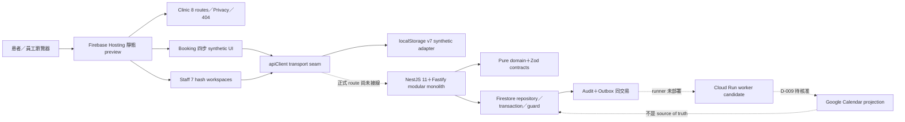
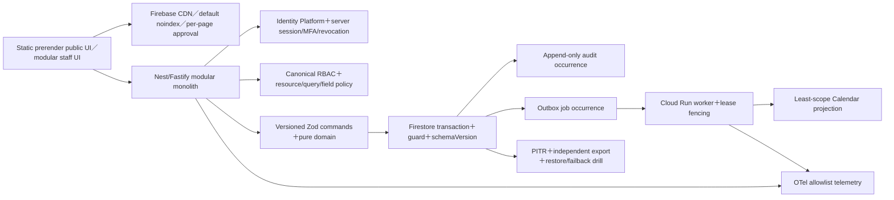
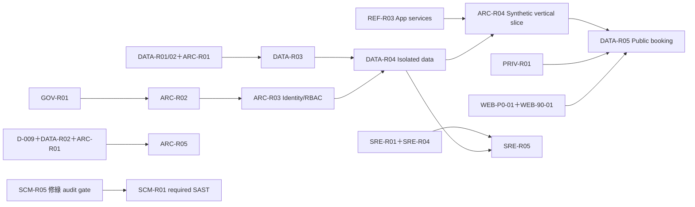

# 診所網站企業級現代化技術稽核與 Roadmap

**查證日期：** 2026-08-11（Asia/Taipei）  
**稽核狀態：** provisional／唯讀靜態稽核；不是上線核准  
**暫定基準：** `beauessence-appointment-platform-fresh`／`agent/clinic-homepage-seo`／`cf597af977c9a96759552ee1e401bb784782cd70`  
**報告語言：** 繁體中文  
**配套產物：** repository 外部交付目錄
`D:\診所專案\audit-deliverables-2026-08-11` 內的 Word 敘事版，以及其
`outputs\audit-20260811` 子目錄中的 Excel 工作簿；三者共用本文件的 ID。
本 Markdown 是 20 章敘事、索引與決策摘要；逐 finding 的完整 evidence／impact 欄、
87 筆逐準則方案評分及 Roadmap 全欄以 Excel 為必要配套，不應把本檔單獨稱為
完整 field-level workbook 的替代品。

> **2026-08-11 晚間更正（Markdown 唯一權威）：** Word／Excel 是同日較早的快照。本
> Markdown 之後追加了兩項更正，binary 尚未重產，兩者以本檔為準：
>
> 1. `SCM-006` 補上稽核基準 commit 自身 CI 的 `pnpm audit` 結果（10 筆、含 1 筆
>    high `nanoid`），嚴重度自「中」提高為「高（阻擋 merge）」。
> 2. 新增 P0 項 `SCM-R05`，Roadmap 由 38 筆增為 **39 筆**；Excel `Roadmap` 仍是 38
>    筆的較早快照。
>
> 除此之外，問題 ID、能力、選項與 Roadmap 結構未變。

> 本文件是 2026-08-11 稽核結果，不是政策核准、部署 authority 或法律意見。沒有證據的內容一律列為假設或待驗證。人日是區間估算，不是承諾日期；正式採購、版本與法規結論須在核准實作當日重查。

## 1. 決策摘要與最重要的五項建議

整體成熟度為 **2.50／5**。核心方向可保留：API-only write path、pure domain、Firestore transaction、transactional outbox、Calendar projection、deny-all direct-client Rules、Native ESM 靜態前端與 modular monolith。現況不需要全面重寫，也沒有證據支持 Kubernetes、微服務或事件溯源。

但目前**不可接上 protected booking route、worker runtime 或真實資料**。最優先五項如下：

1. **維持正式 route／真實資料 gate 關閉。** 先完成 Q-01～Q-08、C0、D-001～D-016 中實際 release scope、隱私逐欄位清單與具名 owner；對應 `GOV-R01`、`PRIV-R01`、`ARC-R02`。
2. **先修三個資料與並行正確性阻斷。** `DATA-001` slot null sentinel、`DATA-002` audit/outbox occurrence ID 碰撞、`ARC-001` worker lease 無 fencing；對應 `DATA-R01`、`DATA-R02`、`ARC-R01`。
3. **先讓供應鏈 gate 變綠，再讓它真正阻擋。** 稽核基準 `cf597af` 上唯一 required 的 `Verification evidence` 目前是**紅的**，因為 dependency audit job 被一筆 high 擋下（`nanoid 3.3.16`，見 `SCM-006`）；必須先由 `SCM-R05` 修綠並逐筆 triage，`SCM-R01`「把 pinned Semgrep 納入 required evidence」的驗收（故意失敗 PR）才分得出擋住 PR 的是 SAST 還是 audit。之後再提高 Node 24 安全 patch floor；對應 `SCM-R05` → `SCM-R01` → `SCM-R02`，既有 alert 的長期 SLA 為 `SCM-R04`。
4. **收斂 canonical identity／roles／RBAC／資料生命週期。** 前端角色不得成為安全邊界，protected route 必須具有 server session、revocation、action/resource/query/field authorization 與 denied audit；對應 `WEB-30-01`、`ARC-R03`、`PRIV-R01/02`。
5. **以 isolated synthetic staging 建立可量測證據。** 先接 structured telemetry，再做 mobile/desktop RUM、人工 AT／實機、cloud restore/failover、真人 incident exercise；對應 `SRE-R02`、`WEB-30-02`、`DATA-R04`、`ARC-R04`、`SRE-R05`。

## 2. 稽核覆蓋範圍、限制、假設與待確認事項

### 2.1 已覆蓋

- README、`AGENTS.md`、`CONTRIBUTING.md`、ADR、決策登錄、架構、產品、法務、runbook 與 review 索引。
- 目錄／模組、workspace 套件、lockfile、runtime、build、lint、typecheck、format、routes、API、auth seam、RBAC、data flow。
- Firestore adapter、schema、migration 狀態、transaction、audit、idempotency、outbox、worker、Calendar adapter。
- GitHub Actions、SAST/SCA/SBOM、secrets、IaC 規劃、Hosting/CSP/noindex 設定。
- Unit、Rules、E2E、performance、accessibility 測試原始碼與近期 dated evidence。
- CSS、tokens、共用元件、responsive、SEO、i18n、圖片與死碼候選。
- 2026-08-11 官方標準、release/lifecycle、安全與法規來源。

### 2.2 未覆蓋與限制

- 未連線正式／staging 網站、GCP/Firebase、IAM、Secret Manager、Calendar、監控、告警、備份、PITR、Search Console 或 billing。
- 遵守唯讀模式：未安裝套件，未執行 build、lint、typecheck、unit、Rules、E2E、SAST、SCA、DAST、load、restore 或瀏覽器測試。
- 未讀取任何 `.env` 真值、secret、service-account key、Calendar ID、病患或薪資資料。
- 2026-08-06／08-10 的測試數只是當日證據，不能宣稱本稽核基準仍為綠燈。
- **GitHub 發佈前唯讀補查（2026-08-11 14:32 +08:00）：** private repository `waydefu/clinic` 的 `main`（`27645a3`）沒有 repository ruleset；branch protection 唯一 strict required context 是 `Verification evidence`，`enforce_admins=false`，沒有 required review。Draft PR #14 的稽核基準 head `cf597af` 顯示獨立 Semgrep 成功，但 supply-chain 與聚合 evidence 失敗。**失敗原因已定位（唯讀讀取 Actions log）：** `Tracked secrets、dependency audit 與 inventory` job 的 `corepack pnpm audit --audit-level high` 回報 `10 vulnerabilities found — 1 low | 8 moderate | 1 high`，該筆 high 是 `nanoid`（vulnerable `<3.3.17`、patched `>=3.3.17`、`GHSA-2v37-7h3g-55p8`），經 `postcss@8.5.20` 進入 dev 工具鏈；`audit:prod` 那一層仍是 0 筆。唯一 required 的 `Verification evidence` 因此連帶失敗，**該 branch 目前無法 merge**。Dependabot API 在 `main` 另回報 9 筆 open development-scope alerts（8 medium、1 low，**不含 high**）——兩個數字不一致，以 CI 為準，詳見 `SCM-006`。secret scanning disabled，code scanning 未啟用。本次只讀 metadata 與 log，未改遠端設定、未執行任何 package command。
- 無流量、RUM、CrUX、API latency、query、queue age、成本、團隊能力；沒有虛構改善百分比。
- 未做真人報讀器、實體裝置、滲透測試、on-call page、tabletop 或 cloud restore/failover。
- 法規部分只做技術適用前提，不替代臺灣或其他司法管轄區的法律意見。

### 2.3 集中假設

| ID | 假設（不是事實） |
| --- | --- |
| A-01 | 暫以 fresh repository、`agent/clinic-homepage-seo`／`cf597af` 為權威基準。 |
| A-02 | 暫按臺灣單一診所、`Asia/Taipei` 營運理解；服務地區與資料主體所在地待確認。 |
| A-03 | 現有 public preview／localStorage 只放 synthetic data，不含真實病患、付款或臨床資料。 |
| A-04 | 因無使用量、團隊與預算，成本只用人日及低／中／高，不估金額。 |
| A-05 | 暫延續 Google Cloud／Firebase，vendor lock-in 可接受度視為中。 |
| A-06 | 預約成功率月 ≥99.5%、API p95 ≤800ms、outbox p95 ≤60 秒、RPO ≤1 小時、RTO ≤4 小時只是核准目標，非達成證據。 |
| A-07 | 英文、付款、臨床／手術、Calendar inbound、多分店均屬規劃或待核准能力。 |
| A-08 | 建議版本只對 2026-08-11 有效；實作核准日須重查 patch、授權、價格與狀態。 |

### 2.4 八個阻斷問題

| ID | 問題 |
| --- | --- |
| Q-01 | 哪個 repository／branch／commit 是權威基準？fresh、public sanitized、舊 private 各自用途為何？ |
| Q-02 | 正式／測試 URL 為何？是否授權只讀存取 Hosting headers、Search Console、RUM、CI、監控與雲端設定？ |
| Q-03 | 法定主體、服務國家、資料主體所在地為何？是否處理健康／病歷／付款／保險／政府資料？ |
| Q-04 | 第一版及三年內確定功能、角色、欄位、保存與刪除政策？D-001～D-016 哪些在 release scope？ |
| Q-05 | 現在與三年後 MAU、尖峰 RPS、每日預約、資料量、檔案量與地區分布？ |
| Q-06 | 團隊人數、能力、預算、目標日期及可用維護工時？ |
| Q-07 | 必須保留／禁止的供應商與技術、lock-in 與資料可攜要求？ |
| Q-08 | 正式 SLO、服務時間、RTO/RPO、backup/audit retention 與 on-call 由誰核准？ |

## 3. 現況架構圖與技術資產清單

| 領域 | 資產／版本狀態 | disposition |
| --- | --- | --- |
| Runtime | Node `>=24.14.0 <25`、pnpm 11.9.0 | 提高安全 floor；release 固定 exact patch/image digest。 |
| Frontend | Native HTML/CSS/ESM；clinic、booking、staff、privacy、404 | 保留；build-time prerender、checkJs、strangler。 |
| Backend | NestJS 11＋Fastify；目前只 routed `/v1/health` | 保留 modular monolith；C2～C6 前不得接 protected route。 |
| Domain／Contracts | TypeScript pure planners＋Zod 4 | 保留；修 correctness，補 persisted codecs/schemaVersion。 |
| Database | Firestore adapter／Emulator，production 未接線 | 保留 Phase 1，經 repository port 隔離。 |
| Queue | Firestore outbox | 保留；加 occurrence identity、fencing、runner、metrics。 |
| Calendar | Google Calendar API v3 candidate；in-memory default | 僅 outbound projection；D-009/D-016 後最小 scope。 |
| Hosting／CDN | Firebase Hosting；CSP；全站 noindex | 保留 preview；改 per-page release/index approval。 |
| IaC | `infra/terraform` 只有 plan，無 `.tf` | C0/authority 後才建立。 |
| CI | GitHub Actions；verify/rules/E2E/supply-chain；Semgrep 獨立 | 保留；SAST 納 required evidence。 |
| Testing | Vitest 3、Playwright 1.61.1、axe-core 4.x | 保留；補瀏覽器、coverage、完整 axe、人工 AT。 |
| SBOM | CycloneDX 1.6、約 920 components、未綁 release digest | 升級 1.7＋SLSA attestation。 |
| Observability | ports/runbooks；API logger off、worker exporter NOOP | OTel＋Cloud Operations；先 synthetic staging。 |

## 4. 功能、角色、資料與信任邊界

現有／規劃能力共 29 項，詳見 §7。現行角色資料分裂為 browser `admin/front_desk` 與 domain canonical `manager/front_desk/consultant/physician/patient/system_admin/auditor/service_account`；`physician` 空權限是刻意 fail-closed，臨床／付款權限受 D-014/D-015 阻擋。

| 邊界 | 可被信任的來源 | 不可被信任／禁止 |
| --- | --- | --- |
| Browser → API | server 驗證的 session、runtime DTO、idempotency key | localStorage、client role、hidden navigation、瀏覽器計時器。 |
| API → Domain | parsed command、actor context、明確 resource scope | controller 重複 business rule、未驗證 cast。 |
| Domain → Firestore | planner output、transaction invariant、versioned codec | direct client access、不同 sentinel、未版本化 document。 |
| Firestore → Worker | unique job occurrence、lease owner/fencing、parsed payload | 只靠 expiry 的 lease、stale unconditional settle。 |
| Worker → Calendar／通知 | 最小 scope、無 P3/S、stable projection key、idempotent effect | transaction 內外呼、full calendar scope、姓名／電話／病歷。 |
| Telemetry／Backup | allowlist、低基數、核准 retention/location | secret、識別碼 label、未核准資料出口、restore 後復活已刪資料。 |

主要資料類型：預約／slot／patient guard、audit、idempotency、outbox、synthetic patient intake、Calendar P2 linkable projection。臨床、手術、卡資料、正式薪資金額目前均不得進入資料模型。

## 5. 企業級成熟度評分

0＝無控制；5＝已部署、可量測且持續改善。總分採權重加總為 **2.50／5**。

| ID | 領域 | 分數 | 主要證據 |
| --- | --- | ---: | --- |
| M-01 | 架構方向 | 4.0 | ADR 支持 API-only、pure domain、transaction/outbox、Calendar projection；API 仍 health-only。 |
| M-02 | Backend production completeness | 1.5 | IdP/session/controllers/runtime 未實作，屬刻意 gate。 |
| M-03 | 資料完整性 | 2.3 | transaction/guard 良好；`DATA-001/002`、persisted codec 缺口阻斷。 |
| M-04 | 前端可維護性 | 2.6 | 有 apiClient/content/token seam；1,955 行 bootstrap、980 行 patient app。 |
| M-05 | 測試與 QA | 3.0 | 分層測試與 E2E completeness gate；本輪未重跑且 browser/coverage 有缺口。 |
| M-06 | 無障礙 | 2.3 | dated serious/critical=0；minor/moderate 不輸出，人工 AT=0。 |
| M-07 | 效能／Web Vitals | 2.2 | 有 byte/request/lab budget；clinic timing 被 skip，無 INP/RUM。 |
| M-08 | AppSec | 2.5 | fail-closed exposure/Rules；C2～C6 未接線，SAST 不在 required evidence。 |
| M-09 | 供應鏈 | 3.0 | lock/pins/SCA/SBOM；runtime floor、history secrets、provenance、SLA 未完成。 |
| M-10 | Reliability／DR／Observability | 1.5 | 有目標與 local drill；無 cloud restore、telemetry backend、alerts/on-call。 |
| M-11 | Privacy／Compliance | 1.8 | 有分級與 packet；controller/purpose/retention/DSR/processor/location 未核准。 |
| M-12 | 文件／治理 | 3.4 | ADR/register/gate 清楚；仍有 CodeQL/Semgrep 與 dated count 漂移。 |

## 6. 全部問題清單

成本：S＝1～3、M＝4～10、L＝10～25、XL＝25+ 人日。行號以稽核基準 commit 為準。
本節列出全部 47 個 ID 的可閱讀索引；`問題／證據` 欄只保留最短定位，不在每列重複
完整 path/line、impact、dependency 與驗證註記。完整逐列欄位在 Excel `Issues`，
因此此表不能單獨作為刪碼、上線或法遵核准證據；沒有獨立證據的項目仍須標待驗證。

| ID | 問題／證據 | 嚴重度 | 信心 | 成本 |
| --- | --- | --- | --- | --- |
| GOV-001 | 權威基準、URL、商業／容量輸入未確認；使用者資料欄未填，workspace 有 fresh/public/舊 private。 | 高 | 高 | S |
| GOV-002 | C0 revise、C1～C6 pending，無 deployment authority；`stage-2-gate-status.json:8-24`。 | Critical（上線） | 高 | M |
| DATA-001 | slot release 寫 `reservationId:null`，domain 用 `!== undefined` 判占用；`booking.repository.ts:141-149`、`appointment-rules.ts:46-60,85-102`。 | 高 | 高 | S |
| DATA-002 | 合法回返狀態重用 audit/outbox occurrence ID；`appointment-transition.ts:163-184,199-273,355-428`、repository `create`。 | 高 | 高 | S-M |
| ARC-001 | lease 無 owner/fencing，stale worker 可 unconditional settle；`outbox-processor.ts:163-247`。 | 高 | 高 | M |
| DATA-003 | Browser 多服務與正式 API/domain 單服務模型分歧。 | 高（上線前） | 高 | M |
| DATA-004 | Idempotency resource enum 在 domain/contract 分歧。 | 中 | 高 | S |
| DATA-005 | Operational documents 缺 runtime codec/schemaVersion。 | 高（上線前） | 高 | M |
| REF-001 | Browser/server canonical roles 與 permission vocabulary 未收斂。 | 高（上線前） | 高 | M |
| REF-002 | Application service/port 只涵蓋 create/reserve，response contract 不完整。 | 高（上線前） | 高 | L |
| REF-003 | Legacy `appointment.ts` 語意重疊且仍 public export。 | 中 | 高 | S-M |
| REF-004 | Preview payload 不符 strict contract，缺穩定 per-intent idempotency key。 | 高（上線前） | 高 | M |
| ARC-005 | `system_admin` 技術／營運權限邊界矛盾。 | 中 | 中 | S |
| FE-SEO-01 | Privacy 草稿 `indexable:true` 且和全站放行開關耦合；`privacy.html:44-54`、`public-pages.json:29-34`、`build-web.mjs:355-392`。 | 高（正式索引前） | 高 | S |
| FE-SEO-02 | 英文版與 hreflang 未實作；D-011 direction 不等於完成。 | 高（若在 scope） | 高 | L |
| FE-SEO-03 | Clinic route metadata 依賴 client JS；`clinic-site.js:867-945`。 | 高（正式索引前） | 高 | M-L |
| FE-02 | `admin-bootstrap.js` 1,955 行 God Controller。 | 中高 | 高 | L |
| FE-03 | `patient-app.js` 980 行，混合 state/validation/DOM/I/O 且 feedback 重複。 | 中 | 高 | M |
| FE-04 | Public browser JS 無 type-aware check。 | 中 | 高 | M |
| FE-05 | 兩套 token foundation 與 ratchet debt。 | 中低 | 高 | M |
| FE-06 | 診所 identity、電話、地址、時間資料分散。 | 中 | 高 | M |
| A11Y-01 | 人工 AT／實機／forced-colors／鍵盤驗收未執行。 | 高（上線前） | 高 | S-M |
| A11Y-02 | axe gate 只阻擋 serious/critical，minor/moderate 也未輸出。 | 中高 | 高 | S |
| A11Y-03 | 404 不在 axe/responsive/affordance inventory。 | 低 | 高 | S |
| PERF-01 | Clinic timing budget 有宣告，但 E2E URL map 缺 clinic 並 `continue`。 | 高 | 高 | S |
| PERF-02 | 無 p75 RUM、INP、mobile/desktop field baseline。 | 高（上線前） | 高 | M |
| PERF-03 | Clinic hero image 等 module render 才被發現，可能延後 LCP。 | 中 | 中 | M |
| QA-01 | Critical flows 缺 Firefox／完整 WebKit／real device。 | 高（上線前） | 高 | M |
| QA-02 | Semgrep 獨立 workflow 未被唯一 required `Verification evidence` 依賴；GitHub branch protection 與 PR #14 checks 已確認。 | 高 | 高；遠端已驗證 | S |
| QA-03 | 測試數量及 CodeQL/Semgrep 文件漂移。 | 中 | 高 | S |
| QA-04 | Unit 無 coverage baseline/threshold。 | 中 | 高 | M |
| SCM-002 | Secret scanner 只掃 tracked tree 與少數 regex。 | 中；正式憑證後高 | 高 | S-M |
| SCM-003 | SBOM 未綁 release artifact/provenance。 | 中（上線前必修） | 高 | M |
| SCM-004 | License allowlist/exception governance 不精確。 | 中 | 高 | S |
| SCM-005 | Node engine 容許已知未修補的 24.14.0。 | 高 | 高 | S |
| SCM-006 | 稽核基準 `cf597af` 的 dependency audit job 紅燈：`pnpm audit --audit-level high` 回報 10 筆（1 low／8 moderate／**1 high**），high 為 `postcss@8.5.20` 帶入的 `nanoid 3.3.16`（`GHSA-2v37-7h3g-55p8`，patched `>=3.3.17`）；唯一 required 的 `Verification evidence` 連帶失敗，branch 無法 merge。Dependabot API 在 `main` 只回報 9 筆（8 medium、1 low、不含 high），兩者不一致以 CI 為準。另無 automated update 與 patch SLA。 | 高（阻擋 merge） | 高；2026-08-10 CI log＋2026-08-11 遠端快照 | S |
| SCM-007 | `main` branch protection 為 `enforce_admins=false`、無 required review/CODEOWNERS，且沒有 repository ruleset。 | 中；正式前高 | 高；遠端已驗證 | S |
| SEC-001 | C2～C6 identity/session/MFA/RBAC/audit/routed E2E 未實作。 | Critical（protected route） | 高 | L |
| SEC-002 | Calendar 使用過寬 `auth/calendar` scope。 | 中（Calendar 前） | 高 | S |
| SEC-003 | Outbox `lastError` 缺中央 sanitizer/length limit。 | 低目前；未來中 | 中 | S |
| SRE-001 | API logger off、worker metrics NOOP、無 backend alerts。 | 高（staging 前） | 高 | M |
| SRE-002 | RPO/RTO 未經 cloud restore/project/region failure 證明。 | Critical（上線） | 高 | L |
| SRE-003 | Incident runbook 無真人召集、on-call 與 production access 演練。 | 高（上線前） | 高 | M |
| PRIV-001 | 正式資料治理欄位與簽核仍空白。 | Critical（真實資料） | 高 | M-L＋法務 |
| PRIV-002 | 永久 audit 與 retention/deletion/backup replay 未調和。 | 高 | 技術高／法律中 | M |
| PRIV-003 | Calendar 被描述為零 PII，但含 P2 linkable ID／就診時間。 | 中 | 技術高／法律中 | S-M |
| PRIV-004 | 臨床／手術 scope 未核准。 | 條件式高 | 中 | M-L |

## 7. 逐功能技術決策矩陣與 ★ 最優方案

預設權重維持：可維護性 25%、安全合規 20%、可靠性 15%、相容／遷移 15%、效能 10%、三年成本 10%、供應商獨立性 5%。分數為本專案適配度，不是市場排名；每項經初篩後保留三個可落地方案。87 筆逐準則分數、版本／正式程度、相容性、安全／隱私／無障礙、效能、維運、遷移、TCO、授權、lock-in、團隊適配、trade-off 與來源在 Excel `Decisions` 工作表；下表是 29 個能力的決策索引，只保留選擇、總分、替代方案與重評條件。

| ID／能力 | ★ 最優方案（分數／信心） | 其他合理方案（分數） | 本專案理由／重評條件 |
| --- | --- | --- | --- |
| F-01 Clinic SEO | Build-time static prerender（5.00／高） | Astro 6（4.00）；Next 16（3.15） | 直接重用 content registry、零新 runtime；CMS、多語、頁數大增再評 Astro。 |
| F-02 Patient UI | Native ESM＋checkJs＋step strangler（4.65／高） | Lit 3（4.05）；React 19＋Vite（3.50） | 可逆、低學習成本；狀態複雜度經量測失控才引框架。 |
| F-03 Staff UI | Native ESM workspace strangler（4.55／高） | React incremental（3.75）；完整 SPA rewrite（2.85） | 保留七工作區既有證據；即時協作／團隊能力達門檻再評。 |
| F-04 API/BFF | NestJS 11＋Fastify modular monolith（4.85／高） | Fastify 5（4.35）；GraphQL（3.10） | 現有 ports/contracts 最相容；獨立故障域與團隊有實證再拆。 |
| F-05 Identity | Identity Platform＋server session cookie（4.25／中高） | Auth0（3.90）；Keycloak 26（2.90） | 與 Firebase/GCP 方向一致；跨雲、B2B federation、成本或禁用供應商時重評。 |
| F-06 Authorization | Shared server RBAC＋resource/query/field policy（5.00／高） | CASL（4.00）；OpenFGA（3.40） | 現有規模不需關係圖；跨組織多層委派才評 OpenFGA。 |
| F-07 Database | Firestore 單區＋repository port（4.40／中高） | Cloud SQL PostgreSQL 18（3.95）；AlloyDB（3.75） | 交易與既有 adapter 合適；複雜財務、報表、多資源交易或成本不符再轉 SQL。 |
| F-08 Codec/Migration | Zod 4 versioned codecs（4.90／高） | JSON Schema 2020-12（4.15）；Firestore Converter/cast（3.35） | 延續現有 Zod；跨語言 consumer 成為主流才提升 IDL。 |
| F-09 Booking correctness | Firestore transaction＋guard＋occurrence IDs（4.95／高） | PostgreSQL SERIALIZABLE（3.85）；Redis locks（2.55） | 修正現有模型最小；容量／資源占用超出 transaction 模型再評 SQL。 |
| F-10 Queue | Firestore outbox＋Cloud Run＋fencing（4.65／高） | Cloud Tasks（4.00）；Pub/Sub（3.70） | 現有原子 outbox 可保留；吞吐／延遲／多 consumer 超門檻再換。 |
| F-11 Calendar | Firestore SoT＋outbound projection（4.30／中高） | ICS/manual（4.20）；Calendar SoT/bidirectional（2.20） | 不讓外部日曆鎖預約；D-016 或 quota/價格改變時重開 ADR。 |
| F-12 Notifications | Vendor-neutral outbox port，Email first（4.75／中） | 單一 SaaS SDK（3.50）；自管 gateway（2.55） | 需求與供應商未定；依國家、channel mix、容量後重評。 |
| F-13 Assets | Firebase Hosting immutable assets（4.90／高） | Cloud Storage signed URL（4.25）；image SaaS（3.75） | 目前無 private upload；核准 upload/轉檔/大量媒體才升級。 |
| F-14 Cache/Search | 不導入外部 cache/search（4.90／高） | Managed Redis（3.40）；search SaaS（3.20） | 無 QPS/latency/search 需求證據；基線超標才引入。 |
| F-15 Analytics/RUM | Privacy-minimized first-party RUM（4.30／中） | GA4（3.75）；PostHog（3.25） | 先只收 web-vitals；漏斗、replay、行銷需 DPIA/consent 後重評。 |
| F-16 Feature flags | Typed config＋少量 audited kill switches（5.00／高） | OpenFeature（3.95）；LaunchDarkly（3.75） | 旗標數與團隊小；實驗治理無法人工管理才導入平台。 |
| F-17 Observability | OTel＋Google Cloud Operations（4.25／中高） | OTel＋Sentry（3.80）；自管 Grafana stack（3.00） | 與 Cloud Run 方向相容；OTel 讓 backend 可替換。 |
| F-18 CDN/WAF/Rate | Firebase CDN＋Cloud Run distributed rate（4.55／中） | Cloud Armor（4.00）；Cloudflare（4.10） | 先維持平台最少；L7 abuse/bot/法規需求成立再加 edge WAF。 |
| F-19 Hosting/IaC | Firebase＋Cloud Run＋OpenTofu 1.12.1（4.45／中） | Terraform（4.25）；GKE（3.05） | 無 K8s 證據；組織政策/provider 相容性改變可改 Terraform。 |
| F-20 CI/Supply chain | Pinned Actions＋required Semgrep＋CDX 1.7＋SLSA 1.2（4.70／高） | Cloud Build（3.60）；GitLab（3.25） | 修正既有流程最小；repo/artifact platform 改變再評。 |
| F-21 QA/A11Y | Vitest＋Playwright＋axe＋manual AT/devices（4.90／高） | Cypress（3.60）；real-device SaaS（3.70） | 保留成熟資產；企業裝置矩陣或 legacy browser 需求再採 SaaS。 |
| F-22 i18n | Build-time locale routes＋ICU messages（4.90／中高） | i18next（3.80）；localized CMS（3.35） | 與 static SEO/no-JS 相容；locale/CMS workflow 大增再評。 |
| F-23 Privacy lifecycle | Versioned field inventory＋app lifecycle jobs/audit（4.80／中） | Firestore TTL（4.00）；privacy SaaS（3.35） | TTL 不能單獨處理 audit、DSR、backup replay；司法地區／資料類型變更即重評。 |
| F-24 DR | PITR＋每小時獨立 project/location export＋IaC drill（3.95／中） | 同區 backup only（4.55）；active/passive replica（2.75） | 硬性可靠性約束覆蓋加權分數：同區方案雖便宜高分，但不能涵蓋 project/region failure，故不得選。 |
| F-25 Payment | 不碰卡資料；D-015 後 hosted PSP（4.55／低） | Payment link/manual（4.30）；direct card API（2.05） | 商業與司法 scope 未定；D-015/PSP 契約後重做 PCI scope。 |
| F-26 Clinical/EMR | 預約平台分界＋合規 EMR/FHIR gateway（3.90／低） | Firestore clinical collections（3.20）；SaaS EMR handoff（3.60） | D-014 未核准；scope、供應商、資料主權確定後完整重評。 |
| F-27 Design System | CSS custom properties＋shared foundation/separate semantics（5.00／高） | DTCG pipeline（4.10）；Tailwind rewrite（3.00） | 保留品牌隔離；多平台/Figma 自動同步時再導入 DTCG。 |
| F-28 Client state | apiClient＋server-authoritative resources＋view-local state（4.90／高） | TanStack Query（4.00）；XState（3.55） | 現有 seam 足夠；離線提交／高頻 invalidation／協作成核心才重評。 |
| F-29 Realtime | bounded polling/refetch＋optimistic feedback（4.65／高） | SSE（3.80）；WebSocket gateway（3.05） | 目前即時要求未成立；新鮮度 <10 秒或 polling 成本超標再評 SSE。 |

## 8. 不可用／不建議／應淘汰技術清單

| ID | 技術 | disposition／理由 |
| --- | --- | --- |
| T-01～03 | Native ESM、Nest/Fastify、Firestore | 保留／漸進升級；Firestore 用 port 包裝並先修 correctness/codec/DR。 |
| T-04 | Browser direct Firestore | 立即禁止；違反 API-only trust boundary。 |
| T-05 | localStorage synthetic store | 只限 preview；不得遷移真實 PII。 |
| T-06～08 | Legacy appointment、browser legacy roles、Firestore outbox | 漸進替換／升級；不可直接刪 public export；outbox 加 fencing。 |
| T-09 | Google full auth/calendar scope | 接線前淘汰，改 events/events.owned＋專用 ACL。 |
| T-10 | Global index switch | 改 per-route＋policyVersion，保留 default noindex。 |
| T-11 | Node >=24.14.0＋浮動 major | 立即升級；release 固定已修補 exact patch/image digest。 |
| T-12～13 | CycloneDX 1.6、Semgrep | SBOM 升 1.7/provenance；Semgrep 保留但必須 truly required。 |
| T-14～18 | GKE、微服務、event sourcing、Kafka、GraphQL、Redis locks、self-host Keycloak/observability | 現階段不建議；需求、團隊、流量與故障域沒有證據支持複雜度。 |
| T-19 | 長效 service-account JSON key | 正式環境禁止；CI 用 WIF、runtime 用 attached identity。 |
| T-20 | 同區 backup/PITR 稱為完整 DR | 禁止此宣稱。 |
| T-21 | Beta/RC/Draft 作核心 normative basis | 禁止；SSDF 1.2 IPD 等只列未來參考。 |
| T-22 | Direct card data／D-014 前 clinical schema | 禁止。 |

## 9. 目標架構與建議 ADR

建議建立：ADR-NEW-01 slot sentinel、02 command/audit/outbox/projection identity、03 lease fencing、04 persisted schema/migration、05 multi-service capacity、06 canonical roles/system_admin、07 intake/booking orchestration、08 per-page index policy、09 frontend/type boundary、10 required checks/break-glass、11 artifact identity/SBOM/SLSA、12 observability/redaction/on-call、13 DR/failback、14 audit retention/DSR/backup exception、15 Calendar security/inbound、16 clinical/EMR/payment transition。

## 10. 必須、建議及暫時不應重構

| ID | 分類 | 範圍／成本 | 驗收與回滾要點 |
| --- | --- | --- | --- |
| RF-001 | 必須 | Slot sentinel；S | 釋放後可重訂且 race 一勝；route 關閉，revert adapter/domain。 |
| RF-002 | 必須 | Occurrence identity；S-M | 合法循環各有獨立 audit/job，exact replay 仍一致；不刪歷史。 |
| RF-003 | 必須 | Worker fencing；M | stale settle 被拒；停 worker／安全回 pending。 |
| RF-004 | 必須 | Persistence codecs/schemaVersion；M | valid/old/corrupt/unknown fixtures；保留舊 decoder。 |
| RF-005 | 必須 | Intake/booking DTO/idempotency；M-L | timeout/retry 不重複、PII 不留 localStorage；transport flag 回滾。 |
| RF-006 | 必須 | Identity/Session/RBAC；L | 401/403/disabled/revoked/client-role negative tests；route 0% 回滾。 |
| RF-007 | 必須 | Per-page legal/index；S-M | 草稿永不 index、8/8 static metadata；全站 noindex 回滾。 |
| RF-008 | 必須 | CI SAST/release gate；S-M | 故意違規 PR 不可 merge；保留獨立 workflow 作回滾。 |
| RF-009～15 | 建議 | App services、admin/patient strangler、type ratchet、tokens/site-data、observability/config、legacy module；S～XL | 逐 slice parity、dual path、feature flag、compat window，禁止全域一次切換。 |
| RF-016 | 暫不應 | 全面前端框架重寫；XL | 僅在量測與 ADR trigger 成立時重開。 |
| RF-017 | 暫不應 | Firestore→SQL 全遷移；XL | p95/cost/model constraint 達閾值才評估。 |
| RF-018 | 暫不應 | Kubernetes／微服務／event sourcing；XL | 必須以 ADR 證明三年收益大於營運成本。 |

## 11. 死碼與冗餘候選

本階段不刪除。高信心必須有至少兩種獨立證據；全文搜尋單獨不足。

| ID | 候選／證據 | 信心／風險 | 驗證與分段回滾 |
| --- | --- | --- | --- |
| DEAD-001～004 | care-listening/treatment/environment/aftercare WebP＋source/manifest/build target；靜態引用與 production dist reachability 均顯示無 runtime reference。 | 部署冗餘高／可刪中；低中 | 查正式 access log、8 route network crawl、視覺 diff；整組移除，git revert。 |
| DEAD-005 | public/vendor/domain 8 個 production-unreachable JS；static closure＋build 全量部署兩證據。 | dist 冗餘高／source dead 低；中 | 只限制 production dist entry closure；source/barrel/tests 保留；先查外部 URL。 |
| DEAD-006 | packages/domain/src/appointment.ts legacy module；static reference＋semantic duplication。 | 中；中高 | 先 deprecated、consumer/coverage/runtime audit、major migration；不可直接刪 public export。 |

## 12. 效能、安全、無障礙、可靠性與維護性優化

每列均為「目前基線 → 證據 → 量化目標 → 解法 → 驗證 → 回歸門檻」。

| ID | 優化閉環 |
| --- | --- |
| OPT-01 | 無 RUM/CrUX → synthetic-only → 28 日 mobile/desktop p75 LCP≤2.5s、INP≤200ms、CLS≤0.1且顯示樣本量 → privacy-reviewed first-party RUM → dashboard → 樣本不足標 unknown，超標進 error budget。 |
| OPT-02 | Clinic timing 未執行 → URL map continue → desktop/mobile FCP≤1.8s、LCP≤2.5s、CLS≤0.1且宣告項全量測 → 補 mapping/completeness → built-dist Playwright → 未量到即 fail。 |
| OPT-03 | 既有 patient/clinic byte/request budget → 先維持 ceiling並建立 route/module/dead-dist 基線 → entry closure/static metadata/conditional preload → manifest/network crawl → 升高 budget 需 ADR/owner/expiry。 |
| OPT-04 | 無 routed API 基線 → 先量 p50/p95/p99/error/RPS → 初始 p95≤800ms、月成功率≥99.5%僅 owner 核准後生效 → OTel/load → 30 日證據 → 無基線不得稱達標。 |
| OPT-05 | 無 production query/cost → 所有 query 具 index/scan/cost、abort/p95/read-write 基線 → inventory/cloud synthetic logs → load/trace/billing → 未測 query 不得 route。 |
| OPT-06 | max6/full-jitter 已有，runner/fencing/telemetry 無 → outbox p95≤60s、stale settle=0、每 dead-letter 告警 → fencing/metrics/reconciliation → deterministic dual-worker/chaos → 任一 stale overwrite 阻擋。 |
| OPT-07 | dated serious/critical=0，minor/moderate unknown，manual=0 → 0 未豁免 WCAG 2.2 A/AA、人工 critical flow 100% → full axe/waiver/AT/devices → CI＋具名 evidence → waiver 過期或 flow 未驗不得 release。 |
| OPT-08 | SAST 非 required、tree-only secrets → Critical/High 未豁免=0、SAST commit-bound、fixture 100% detect → required Semgrep/Gitleaks/SCA SLA；IaC/container 出現即掃 → 故意失敗 PR → 缺 security job 不得 merge。 |
| OPT-09 | CDX 1.6、90 日、未綁 artifact → 100% release 有 validated CDX 1.7、digest、SLSA 1.2 attestation/signature → 生成／驗簽 → 離線驗證 → 缺件不得發布。 |
| OPT-10 | Node floor 24.14.0、無 patch SLA → Critical 24–48h、High 7d、Moderate 30d完成判斷且逾期0 → exact patch/digest＋owner/update PR → old-patch negative test → 舊安全版不得 release。 |
| OPT-11 | RPO1h/RTO4h 只是目標、cloud drill=0 → database/project/region 三類季度達標 → PITR＋secondary export/IaC/deletion replay → V1～V6/failback → 未達則 launch gate 關閉或正式下修 SLO。 |
| OPT-12 | logger off／NOOP／on-call unknown → trace coverage100%、P3/S telemetry=0、page p95≤5m、ack由owner核准 → allowlist OTel＋primary/backup → 敏感 fixture/tabletop → 洩漏或無owner alert不得上線。 |
| OPT-13 | public JS 無 type-aware/coverage/cycle baseline → boundary type coverage100%、cycles0、duplication不升、critical flake<1%（先量） → checkJs/graph/coverage/strangler → CI history → baseline只降不升。 |
| OPT-14 | 0/8 static metadata、English/hreflang=0 → public route metadata100%、locale parity100% → prerender/locale schema/per-page approval → parser/crawler/manual language QA → 草稿、混語或缺欄阻擋。 |
| OPT-15 | field worksheet全 TBD、DSR無 → production field 100% 有 purpose/basis/role/retention/delete/processor/location → versioned inventory/lifecycle/tombstone → contract/log/Calendar/restore negative tests → 未核准欄位不得 migration。 |
## 13. 資料及 API 遷移方案

1. 決策與 gate：完成 Q-01～08、release-scope D-series、C0；沒有資料變更，回滾即維持現況。
2. Correctness：先補 `DATA-001/002`、`ARC-001` 與 codec regression，route 仍 0%；只用 Emulator/synthetic。
3. Canonical identities/roles：browser state v8 `admin→manager`，unknown fail-closed；command occurrence 與 projection ID 分層。
4. Intake/versioned API：patient intake 取得 opaque patientId，strict serviceIds、per-intent idempotency；controller→application→port。
5. Schema dual-read：document 帶 `schemaVersion`，先 dual-read，必要時 dual-write，可重入 backfill；每批 checkpoint。
6. Identity/session/RBAC：server session/MFA/revocation，scope-aware query＋field projection＋denied audit；按 role/route 漸放量。
7. Synthetic staging vertical slice：isolated project、WIF/IAM/Secret、Cloud Run/Firestore/worker，只用合成資料。
8. Evidence：OTel/alerts、load/RUM、PITR/secondary restore、incident/manual A11Y；超 error budget 停 promotion。
9. Public cutover：per-page privacy/index approval、policy acceptance、API transport；synthetic localStorage 清除、不遷移。
10. Calendar/notification：outbound projection 可由 Firestore 重建；provider port 逐 channel 啟用。
11. Expansion S/payment/inbound：各自新 ADR/threat/legal/data migration，不沿用 appointment 核准。

## 14. 分階段 Roadmap

每項均有唯一 ID、owner、人日、依賴、風險、遷移、回滾與驗收；完整長欄位在 Excel `Roadmap`。以下是可執行摘要。

### P0：立即處理

| ID | 範圍／相依 | Owner／人日 | 遷移、回滾與驗收 |
| --- | --- | --- | --- |
| GOV-R01 | 權威基準、URL、主體、scope、容量、限制、SLO owner；無依賴 | Architect＋Clinic/Product；2–5 | 簽署 Q-01～08；未完成即 provisional、所有 gate 關閉。 |
| DATA-R01 | Slot sentinel；ADR-NEW-01 | Backend/Data/QA；1–2 | compat read/test→write；revert；釋放後可重訂且 race 一勝。 |
| DATA-R02 | Unique audit/outbox occurrence；ADR-NEW-02 | Backend/Data/QA；2–4 | 新 command 用新格式；不刪舊記錄；合法循環獨立且 replay一致。 |
| ARC-R01 | Lease token/generation conditional settle；ADR-NEW-03 | Backend/SRE/QA；3–5 | backward-compatible schema；停 worker/回 pending；stale settle=拒絕。 |
| SCM-R05 | 修綠 dependency audit gate：`nanoid` 提升到 `>=3.3.17`（升 `postcss` 或加 pinned override），並逐筆 triage 那 10 筆／Dependabot 9 筆；`SCM-006`；無依賴，是 `SCM-R01` 的前置 | AppSec/Maintainer；1–2 | 只改 manifest/lockfile，不動 runtime source；`git revert` 即回滾；驗收＝`Verification evidence` 與 dependency audit job 在同一 commit 轉綠，且每筆殘留 alert 有 owner／理由／到期日。 |
| SCM-R01 | Semgrep 進 required evidence＋修正已確認的 remote enforcement gap；**相依 `SCM-R05`** | AppSec/CI；1–2 | 故意失敗 PR；保留獨立 workflow；紅 SAST 不可 merge。**前置：aggregate 必須先為綠，否則分不出擋住 PR 的是 SAST 還是 audit，驗收無效。** |
| SCM-R02 | Node 安全 floor/exact digest | Runtime/AppSec；1 | CI compatibility；只能退到已修補 patch；old-patch negative test。 |
| WEB-P0-01 | Per-page/per-policy index approval；D-003 | FE/Privacy/SEO；2–4 | default false；全站 noindex 回滾；草稿永不由 global switch 放行。 |
| WEB-P0-02 | Clinic performance mapping/completeness | FE/QA；1–2 | 先 observation；不得 skip；所有 timing desktop/mobile 實測。 |
| WEB-P0-03 | Full axe artifact＋expiring waiver | QA/A11Y；1–3 | report→blocking；0 未豁免 A/AA，artifact 綁 commit。 |
| PRIV-R01 | Controller/contact、field lifecycle、DSR、processor/location 簽核 | Privacy/Legal/Clinic/Data；5–15＋法務 | 只改決策清單、不收真資料；100% field/policy/DSR DoD。 |
| SRE-R01 | DR topology 或正式下修 RPO/RTO | SRE/Cloud/Clinic；5–10 | ADR/成本情境、不建資源；含 failover/failback/deletion replay/drill。 |

### 0～30 天

| ID | 範圍／Owner／人日 | 核心驗收／回滾 |
| --- | --- | --- |
| DATA-R03 | enum alignment＋codec/schemaVersion；Data/Backend/QA；4–7 | dual-reader，corrupt doc 隔離告警；保留舊 decoder。 |
| ARC-R02 | 完成 ADR-NEW-01～16＋release-scope decisions；跨職能；5–12 | 每 ADR 有 alternatives/owner/date/rollback/revisit；未核准保持 pending。 |
| WEB-30-01 | Canonical roles＋localStorage v8；FE/BE/AppSec；5–10 | admin→manager、unknown fail-closed、五角色矩陣；舊 preview key 唯讀回滾。 |
| WEB-30-02 | Manual keyboard/zoom/colors/SR/devices；A11Y/QA/Product；3–6 | critical flows 100% evidence；缺陷未清即不發布。 |
| WEB-30-03 | Chromium/Firefox/WebKit＋coverage/type baseline；QA/FE；6–12 | observation→blocking；critical 不永久 skip。 |
| SCM-R03 | Pinned Gitleaks diff/tree/history；AppSec/CI；2–5 | synthetic fixture 100%、raw secret output=0。 |
| SCM-R04 | Patch SLA/update PR/license expiry；AppSec/Maintainer/Legal；2–4 | Critical 24–48h、High 7d、Moderate 30d判斷，逾期0。 |
| SRE-R02 | Redacted OTel/dashboard/synthetic alerts；SRE/BE/AppSec；5–10 | correlation100%、sensitive fixture=0；可關 exporter。 |
| SRE-R03 | 真人 tabletop、contacts、JIT access；SRE/Clinic/Security；3–5 | page/ack/access/decision log 有量測；不切 production。 |

### 31～90 天

| ID | 範圍／Owner／人日 | 核心驗收／回滾 |
| --- | --- | --- |
| REF-R03 | 完整 app services/ports/contracts；BE/Architect/QA；8–15 | 無 concrete adapter 直連；取消 module registration 回滾。 |
| ARC-R03 | C1～C4 identity/session/MFA/revocation/RBAC；BE/AppSec/Cloud/QA；15–30 | 全 negative tests；route 0%/前 revision。 |
| DATA-R04 | C5 isolated Firestore/index/migration/PITR；Data/Cloud/SRE/QA；15–25 | synthetic transaction/codec/index/backup evidence；isolated rollback。 |
| ARC-R04 | C6 staff/public synthetic E2E；BE/FE/QA/AppSec；15–25 | feature flag/allowlist；所有 boundary/error/rollback acceptance。 |
| WEB-90-01 | Clinic prerender＋canonical data＋8/8 metadata；FE/SEO/Content/A11Y；8–15 | CSR/static diff；舊 CSR＋noindex 回滾。 |
| WEB-90-02 | English/i18n/hreflang；Product/Content/FE/A11Y；10–20 | locale parity100%，缺譯 noindex；關 locale route 回滾。 |
| SCM-R06 | CDX1.7＋digest＋SLSA/signature；AppSec/Release/SRE；4–10 | offline verify；缺 evidence 不 promote。 |
| SRE-R04 | WIF/SA/Secrets/IaC/IAM negative；Cloud/SRE/AppSec；10–20 | 長效 key=0；revert revision/disable provider，不用 destroy 當一般回滾。 |
| SRE-R05 | Database/project/region cloud restore drill；SRE/Data/Privacy/Clinic；15–30 | 三類達標或正式下修 SLO；保留 primary。 |

### 3～6 個月

| ID | 範圍／人日 | 核心驗收／回滾 |
| --- | --- | --- |
| ARC-R05 | Worker/Calendar outbound/metrics/reconciliation；15–25 | shadow→小比例；queue p95≤60s，stop projector/fake adapter。 |
| DATA-R05 | Public booking/privacy/retention/DSR/移除 localStorage PII；20–40 | 分 route/比例＋manual fallback；route 0% 回滾。 |
| WEB-180-01 | Admin/Patient strangler＋type ratchet；20–40 | 每 workspace/step parity；legacy flag 回滾。 |
| SRE-R06 | 30 日 SLI/capacity/error budget；5–10 | owner 核准 SLO；可退 observation 但保留 dashboard。 |
| PRIV-R02 | Audit retention/pseudonymization/DSR/restore replay；5–10＋法務 | synthetic dry run/checkpoint；已刪資料不復活。 |
| WEB-180-03 | Privacy-minimized RUM；5–10 | 28 日 device-separated p75、sensitive field=0；kill switch。 |

### 6～12 個月

| ID | 範圍 | 驗收／重評 |
| --- | --- | --- |
| ARC-R06 | Surgery/payment/inbound Calendar/multi-branch 逐能力重做稽核 | D-014～016/new ADR；每能力 3～5 方案、法規、migration/rollback/DoD。 |
| SRE-R07 | 季度 restore/incident；年度 ASVS/pen test/EOL | 季度 RPO/RTO/page exercise，年度 ASVS 5 mapping 與具名例外。 |
| RUN-R01 | Node 26 LTS 決策 | 2026-10-28 轉 LTS 後雙版本 CI/canary；全部 gate/rollback 後才切。 |

## 15. 相依關係、Critical Path 與可平行工作

可平行：P0 的三個 correctness、index、performance、axe；0～30 天的 roles/manual A11Y/browser、secret/SLA、telemetry/tabletop；31～90 天的 prerender、app services、provenance、WIF（但共享 ADR/authority）。

**唯一新增的 P0 硬順序：** 供應鏈那條不可平行——`SCM-R05` 必須先讓 aggregate 轉綠，`SCM-R01` 才收得緊、驗得出來；`SCM-R02` 與兩者皆無相依，可平行。在 `SCM-R05` 完成前，該 branch 無法 merge，任何「gate 已通過」的宣稱都不成立。

## 16. 測試矩陣、CI Quality Gates 與 Definition of Done

測試矩陣共 18 層：domain、persisted codec、Firestore integration、dual-worker concurrency、API contract、auth/RBAC、frontend unit、public/staff E2E、automated/manual A11Y、SEO/i18n、performance、security/supply chain、privacy negative、load/chaos、DR、incident。Critical paths 至少跑 Chromium、Firefox、WebKit；實機與 AT 仍是 release gate。

Quality Gates：`QG-01` required evidence 必含 SAST；`QG-02` exact runtime/security floor；`QG-03` build/type/lint/contract；`QG-04` data correctness；`QG-05` auth/privacy；`QG-06` WCAG＋manual；`QG-07` budget/lab/RUM；`QG-08` immutable artifact/SBOM/attestation；`QG-09` operational evidence；`QG-10` per-page public approval。

Definition of Done：

- 每個變更有 Roadmap/ADR/issue ID、owner、scope、非目標、風險、依賴。
- 證據綁實際 commit/immutable artifact，不以舊測試數冒充現況。
- Input/error/persistence/external payload 皆 runtime parse，unknown fail-closed。
- Server authn/authz 的 action/resource/query/field/denied audit 分別測試；UI guard 不算安全。
- Breaking schema/API 具 dual-read/backfill/cutover/rollback/reconciliation。
- Telemetry 不含 P3/S，labels 低基數，retention/processor 核准。
- WCAG 2.2 AA 自動＋人工 evidence；不得把 Lighthouse/axe 等同全面品質或合規。
- SAST/SCA/secrets/SBOM/provenance/version/license 通過；例外有 owner/reason/expiry。
- SLI/SLO/error budget/dashboard/alerts/runbook/restore/rollback exercise 符合風險。
- ADR/API/runbook/version EOL/on-call ownership 與實作同一 PR 更新。

## 17. 風險登錄表及回滾計畫

| ID | 風險／影響 | 預防／回滾 | Owner |
| --- | --- | --- | --- |
| RISK-01 | 錯用非權威基準／高 | 簽署 baseline；gate 關閉並在正確 commit 重稽核。 | Architect |
| RISK-02 | 提前 route/真資料／Critical | C0～C6/Privacy gate；route 0%、manual booking、incident/DSR。 | Product/AppSec |
| RISK-03～05 | slot、occurrence、stale worker／高 | `DATA-R01/02`、`ARC-R01`；route 0%、停 worker、reconcile。 | BE/Data/SRE |
| RISK-06 | Authorization/field leakage／Critical | canonical server policies/negative tests；revoke sessions、route 0%、audit。 | AppSec/BE |
| RISK-07 | Privacy draft indexed／高 | per-page default noindex；立即 X-Robots noindex、移 sitemap、removal request。 | Privacy/SEO |
| RISK-08～09 | SAST/secret/runtime/supply-chain bypass／高 | required gate、exact patch、SBOM；freeze release、rotate/rebuild/revert。 | AppSec/CI/Runtime |
| RISK-10 | PII 進 telemetry/Calendar/error／高 | allowlist/negative fixtures；關 exporter/projector、限制 access、incident。 | Privacy/AppSec/SRE |
| RISK-11～12 | DR 不達、告警無人／Critical/高 | secondary/drill/contacts/JIT；manual booking、restore/switch/escalate。 | SRE/Clinic |
| RISK-13 | Accessibility blocker／高 | Full axe＋manual AT；撤 route、電話/人工替代。 | A11Y/Product |
| RISK-14 | Rewrite/over-engineering／高 | Strangler/ADR trigger；停止新架構、回小步模組化。 | Architect/Product |
| RISK-15 | Calendar quota/sync／中高 | outbox/reconcile/least scope；停 projector、人工 Calendar、重建。 | SRE/Ops |
| RISK-16 | Clinical/payment 法規擴張／Critical條件式 | 獨立 D-014～016/threat/legal；feature off、data segregation/vendor exit。 | Legal/Privacy/Product |

## 18. 維護責任、Runbook、文件與版本淘汰政策

| ID | Owner／頻率 | 產物與政策 |
| --- | --- | --- |
| OW-01 | Architect；重大決策／季度 | ADR/register/critical path；矛盾 30 日內處理。 |
| OW-02 | Runtime＋AppSec；每週／安全公告 | exact runtime、lock/SBOM/license；Critical24–48h、High7d、Moderate30d；Node 24 EOL 2028-04-30 前遷移。 |
| OW-03 | FE＋A11Y；每 PR/release/半年 | tokens/routes/browser/manual AT；token ceiling 只降，標準年度重核。 |
| OW-04 | BE＋Data；每 schema/API | Zod/schemaVersion/migration/reconcile；至少兩個 reader 版本窗口。 |
| OW-05 | AppSec＋Privacy＋Clinic；每角色/欄位/processor／年度 | MFA/session/RBAC/field inventory/DSR；owner/basis 缺即不得收集。 |
| OW-06 | SRE primary＋backup；持續／每月 | SLI/SLO/dashboard/alerts/runbooks；無 owner/runbook alert 不上線。 |
| OW-07 | SRE＋Data＋Clinic；季度／年度 | Restore/failover/tabletop/JIT/contacts；未達即修計畫或降 SLO。 |
| OW-08 | Release＋AppSec；每 PR/release | required gates、immutable promotion、attestation；保存至少等同 release 支援期。 |
| OW-09 | Content＋Privacy＋SEO；每發布 | legal/content/canonical/hreflang/policyVersion；未核准 route/locale default noindex。 |
| OW-10 | 各服務 owner；季度 | Runbook owner/contact/permissions/rollback/last drill；90 日未驗證標 stale。 |

## 19. 官方資料來源

全部於 2026-08-11 查證；草案與正式版分開。

| ID | 來源／版本／狀態 | URL |
| --- | --- | --- |
| SRC-01 | WCAG 2.2；W3C Recommendation | https://www.w3.org/TR/WCAG22/ |
| SRC-02 | OWASP ASVS 5.0.0；Stable 2025-05-30 | https://owasp.org/www-project-application-security-verification-standard/ |
| SRC-03 | OWASP Top 10:2025；Final | https://owasp.org/Top10/2025/ |
| SRC-04/30 | Web Vitals／CrUX；official field guidance | https://web.dev/articles/vitals/ · https://developer.chrome.com/docs/crux |
| SRC-06 | NIST SP 800-218 SSDF 1.1；Final | https://csrc.nist.gov/pubs/sp/800/218/final |
| SRC-07 | NIST SP 800-218 Rev.1 1.2；**Initial Public Draft，非 normative baseline** | https://csrc.nist.gov/pubs/sp/800/218/r1/ipd |
| SRC-08/20 | NIST SP 800-63-4／63B-4；Final | https://csrc.nist.gov/pubs/sp/800/63/4/final |
| SRC-09 | CycloneDX 1.7；current formal | https://cyclonedx.org/specification/overview/ |
| SRC-10 | SLSA 1.2；Approved | https://slsa.dev/spec/v1.2/ |
| SRC-11/12 | GitHub artifact attestations／required checks；GA docs | https://docs.github.com/en/actions/how-tos/secure-your-work/use-artifact-attestations/use-artifact-attestations |
| SRC-13 | Browser Baseline 2026；official guidance | https://web.dev/baseline/2026 |
| SRC-14～17 | Astro 6、Next 16、React 19、NestJS 11；stable | https://astro.build/blog/astro-6/ · https://nextjs.org/blog/next-16 · https://react.dev/blog/2024/12/05/react-19 · https://docs.nestjs.com/ |
| SRC-18/19 | Firebase session cookies／Identity Platform release notes；GA | https://firebase.google.com/docs/auth/admin/manage-cookies |
| SRC-21～24 | Firestore locations/backups/transactions/export；GA | https://firebase.google.com/docs/firestore/backups |
| SRC-25 | Cloud Run locations；GA | https://docs.cloud.google.com/run/docs/locations |
| SRC-26～29/45 | Calendar v3 sync/push/errors/quota／OAuth scopes；stable official | https://developers.google.com/workspace/calendar/api/guides/sync |
| SRC-31/32 | OpenTelemetry／Google Cloud Operations；stable/GA | https://opentelemetry.io/docs/specs/ · https://cloud.google.com/products/operations |
| SRC-33/34 | OpenTofu 1.12.1 stable／Google Cloud Terraform docs | https://github.com/opentofu/opentofu/releases/tag/v1.12.1 |
| SRC-35 | axe-core 4.x stable | https://github.com/dequelabs/axe-core |
| SRC-36 | Google localized versions/hreflang guidance | https://developers.google.com/search/docs/specialty/international/localized-versions |
| SRC-37 | 臺灣個資法官方整合頁；2025 修法部分條文施行日未定，頁面另連結現行舊法規內容 | https://law.moj.gov.tw/LawClass/LawAll.aspx?pcode=I0050021 · https://law.moj.gov.tw/LawClass/LawOldVer.aspx?pcode=I0050021 |
| SRC-38 | 醫療法；2026-05-15 修正 | https://law.moj.gov.tw/LawClass/LawAll.aspx?pcode=L0020021 |
| SRC-39 | 醫療機構電子病歷製作及管理辦法；現行法規命令 | https://law.moj.gov.tw/LawClass/LawAll.aspx?pcode=L0020121 |
| SRC-40 | PCI DSS 4.0.1；current formal | https://www.pcisecuritystandards.org/document_library/?class=pcidss&doc=pci_dss |
| SRC-41 | HL7 FHIR R4 4.0.1；Normative/Standard | https://hl7.org/fhir/R4/ |
| SRC-42～44 | Node 24.18.0 LTS／26 Current及 24.14.1、24.17.0 security releases | https://nodejs.org/en/about/previous-releases |
| SRC-46 | Google WIF best practices；official | https://docs.cloud.google.com/iam/docs/best-practices-for-using-workload-identity-federation |

完整 46 筆直接 URL、applicability、版本與狀態在 Excel `Sources` 工作表；重大決策應在實作日再次查證。

## 20. 尚未能驗證的項目

| ID 群組 | 待驗證 |
| --- | --- |
| UV-01～03 | 權威 repo/branch 的業主認定、正式/staging URL/headers、目前 HEAD 實跑。 |
| UV-05～10 | GCP/Firebase/IAM/Secrets/WIF/billing、實際 Firestore、backup/DR、runner/Calendar、auth/RBAC、edge/log redaction。 |
| UV-11～14 | MAU/RPS/data/cost/browser、RUM/API/query/outbox、manual A11Y、DAST/pen/container/IaC scan。 |
| UV-15～20 | 法定主體／司法地區／processor、法規適用、D-series policy、system_admin、English scope、final privacy policy。 |
| UV-21～25 | Dead assets/vendor external consumers、domain package外部 consumer、social crawler image、團隊/預算/lock-in、notification/file/search/realtime需求。 |

`UV-04`（GitHub branch protection／Dependabot）已由 2026-08-11 14:32 +08:00 的
唯讀 API 補查關閉；這不等於任何 GCP、Hosting、production 或 CI 新 commit 已驗證。

## 最終品質自檢

- 29 個現有／規劃／共用能力均有三個合理方案與唯一 ★；不以熱門度取代本專案證據。
- 47 個 finding ID 均在 Excel `Issues` 具有 evidence／impact／confidence 欄；Markdown §6 是縮寫索引，不冒充完整逐列證據，且未把 dated tests 當 HEAD 結果。
- 15 項優化均有 baseline、target、solution、validation、regression threshold。
- 39 個 Roadmap ID 均有 phase、owner、人日、依賴、風險、遷移、回滾與驗收；§14 的「3～6 個月」「6～12 個月」兩表為節省寬度未列 owner／人日欄，詳欄在 Excel。Excel `Roadmap` 是 38 筆的較早快照，缺後補的 `SCM-R05`。
- 正式標準、GA/LTS、Draft/Beta/Preview、Deprecated/EOL 已分開。
- 未把 Lighthouse、axe、Emulator 或同區 backup 宣稱為全面品質、合規或完整 DR。
- 列出目前不需改的穩定架構，沒有預設全面重寫或強行加入 K8s／微服務。
- 所有未存取範圍集中列於 §2 與 §20；本報告完成後停止，等待明確 Roadmap ID 核准。
