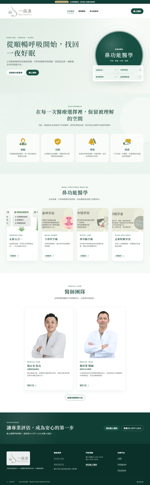

# UI 視覺基準與目前進度 — 2026-07-28

**狀態：** 本文件是 2026-07-28 的 dated evidence，用來回答「現在做到哪裡」與
「現行畫面長什麼樣」。它不是 production 核准、政策核准或跨作業系統像素 golden。
現行工作權威仍是 [roadmap](../roadmap.md)、[Phase 1 execution plan](../phase-1-execution-plan.md)
與 [decision register](../product/phase-1-decision-register.md)。

> **同日後續決策註記：** 截圖本身是決策回覆前的像素證據；下方進度表已同步成
> 回覆後狀態。業主已核准 D-010 target architecture/SLO，並確認 D-004 的正式
> 營業時間與多項服務方向；D-006 仍 pending，最新狀態以決策登錄與 roadmap 為準。

## 1. 已核實的目前進度

| 項目 | 2026-07-28 現況 | 依據／限制 |
| --- | --- | --- |
| Delivery stage | **Stage 0 architecture hardening 與 Checkpoint A 已通過；目前在 Stage 1 owner decisions** | [Stage 0 Checkpoint A](stage-0-checkpoint-a-2026-07-24.md) |
| 決策 gate | D-010 target 已核准；D-006 與 Stage 2 change review 仍阻擋 cloud staging。D-004 已確認正式時段與多項服務方向，但精確時長／容量規則仍待答覆 | [decision register](../product/phase-1-decision-register.md) |
| API | 可路由 controller 只有 `/v1/health`；appointment application/repository 仍未掛路由 | `apps/api/src/app.module.ts`、`apps/api/src/health.controller.ts` |
| 資料與整合 | 工作臺與預約仍是 browser-local 合成資料；沒有真 IdP、cloud Firestore booking route、Calendar、LINE、Meta 或 NAS 寫入 | 不得把 UI 角色切換或綠色測試當成 production security |
| Git 移機 | `main` 使用 HTTPS remote `https://github.com/waydefu/clinic.git`；本基準以「包含本 manifest 的 commit」綁定 | manifest 不寫自身 commit hash，避免不可能的 self-reference |
| 到期預覽 | 2026-07-28 17:18 Asia/Taipei 複查 `/`、`/booking`、`/privacy`、`/clinic` 均 HTTP 200、`no-cache`、`noindex`；文件記錄到期為 2026-08-04 12:43 | 這是 2026-07-27 已部署版本，不代表本文件所在 commit 已重新部署，也未部署 live channel |

因此下一步不是直接啟用後端：先完成 D-006 的剩餘身分與稽核邊界，再依已核准的
D-010 target 提出 Stage 2 cloud foundation／staff identity change plan。現階段可
安全維護的仍是 local、Emulator、synthetic UI、文件、測試與不啟用新能力的設計。

## 2. 現行參考畫面

以下兩張是本次重新產生的現行代表圖，不是 2026-07-20 的舊圖。

完整集合：

| Route／角色／狀態 | Viewport | 參考圖 |
| --- | ---: | --- |
| `/clinic`／public／home | 1280×900 | [clinic home desktop](assets/ui-visual-baseline-2026-07-28/clinic--home--desktop-1280x900--light.png) |
| `/clinic`／public／home | 375×812 | [clinic home phone](assets/ui-visual-baseline-2026-07-28/clinic--home--phone-375x812--light.png) |
| `/booking`／public／step 1 | 1280×900 | [booking step 1 desktop](assets/ui-visual-baseline-2026-07-28/booking--step-1--desktop-1280x900--light.png) |
| `/booking`／public／step 3，固定合成欄位 | 375×812 | [booking step 3 phone](assets/ui-visual-baseline-2026-07-28/booking--step-3-filled--phone-375x812--light.png) |
| `/booking`／public／step 3，低寬低高壓力狀態 | 320×568 | [booking step 3 stress](assets/ui-visual-baseline-2026-07-28/booking--step-3-filled--stress-320x568--light.png) |
| `/`／未登入／login gate | 1280×900 | [workbench login desktop](assets/ui-visual-baseline-2026-07-28/workbench--login--desktop-1280x900--light.png) |
| `/#appointments-section`／admin／一筆合成預約 | 1280×900 | [appointments desktop](assets/ui-visual-baseline-2026-07-28/workbench--appointments-populated--desktop-1280x900--light.png) |
| `/#appointments-section`／admin／一筆合成預約 | 375×812 | [appointments phone](assets/ui-visual-baseline-2026-07-28/workbench--appointments-populated--phone-375x812--light.png) |
| `/#case-section`／admin／到診、已指派個管 | 1280×900 | [case workload desktop](assets/ui-visual-baseline-2026-07-28/workbench--case-assigned-workload--desktop-1280x900--light.png) |
| `/privacy`／public／未核准告知草稿 | 375×812 | [privacy draft phone](assets/ui-visual-baseline-2026-07-28/privacy--draft-notice--phone-375x812--light.png) |

2026-07-20 的
[booking flow](assets/test-only-booking-flow-2026-07-20.png) 與
[case-manager workload](assets/test-only-case-manager-workload-summary-2026-07-20.png)
保留為歷史 checkpoint 證據；檔名、引用與 dated review 都不得再稱它們為現行 UI。

## 3. 可重現條件

- 指令：`corepack pnpm capture:ui`
- runner：Playwright 1.61.1／Chromium 149.0.7827.55／Windows 10.0.22631 x64
- 固定時間：`2026-07-29T01:00:00.000Z`
- locale／timezone：`zh-TW`／`Asia/Taipei`
- theme／motion：light／reduced
- DPR：1；workers：1；local server：`127.0.0.1:3211`
- 每個情境先清空 `localStorage`，只寫固定 light theme；所有患者、帳號與預約均為
  明示合成值。
- 截圖前必須完成圖片 decode、字型 ready、network idle、兩個 animation frames，
  並驗證沒有水平 overflow、console error 或 warning。
- Chromium full-page 拼接會把 fixed／sticky 元件畫到任意片段。capture harness
  透過同源、只存在於 Playwright route 的 stylesheet，將 sticky header／navigation／
  status 暫時放回文件流，並隱藏未聚焦的 skip link。這不放寬 production CSP；
  實際 sticky 與鍵盤焦點行為仍由 E2E 驗證。

完整機器資訊、route、role、state、viewport、DPR、capture kind、console counts
與每張 PNG 的 SHA-256 在
[manifest.json](assets/ui-visual-baseline-2026-07-28/manifest.json)。
`scripts/check-structure.mjs` 會驗證 manifest 與十張 PNG 的集合、hash、寬度、
最小高度及 console 計數，避免圖片被靜默替換或遺失。

## 4. 如何解讀

這些圖是跨電腦人工 review 的**參考證據**，不是 Windows 與 Linux 共用的逐像素
release gate。專案使用系統字型，不同 OS 的中文字形與 metrics 會不同；直接把
Windows PNG 當 Linux CI golden 會產生假失敗。自動 gate 仍以 DOM 語意、axe、
320px～桌面 reflow、觸控目標、幾何、CSP、console 與完整 E2E 為準。

圖片也不能證明正式資料安全、後端授權、法務核准、Calendar 一致性或 production
可用性；那些仍受 Stage 1～6 的決策與驗證 gate 約束。

## 5. 本次提交前驗證

| Gate | 結果 |
| --- | --- |
| `corepack pnpm capture:ui` | 1/1 capture test 通過；10 張 PNG；每個情境 console error/warning = 0 |
| `corepack pnpm verify` | 42/42 test files、551/551 tests；structure、architecture、UI、public pages、design tokens、docs、tracked secrets、Prettier、capture-config types、workspace build/types、ESLint、domain sync 與 performance budget 全數通過 |
| `corepack pnpm test:rules` | 6/6 test files、62/62 tests；Emulator 關閉完成 |
| `corepack pnpm test:e2e` | Chromium 164/164 tests 通過 |
| `corepack pnpm check:supply-chain` | 通過；產生 921-component／80-runtime-component SBOM 後已清除可重建檔；audit 保留一筆文件化且具解除條件的 `GHSA-mh99-v99m-4gvg` 例外，license policy 的 3 筆 dev-only metadata 例外均已審視 |
| 殘留與 Git／remote | 已移除本輪 `dist`、asset manifest、SBOM、Firestore log 與 Playwright test-results；無測試／Emulator listener。提交前 `git fetch --prune` 後基準 HEAD、`origin/main`、`ls-remote` 同為 `8745a5e`，ahead/behind `0/0`；最終包含本文件的 commit 由 Git remote 狀態綁定，不在文件內做 self-reference |
