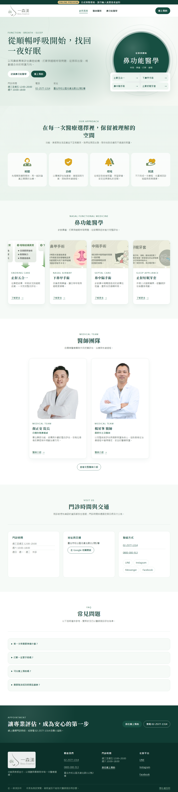
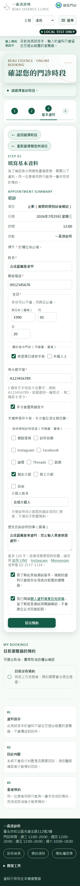

# UI 視覺基準 — 2026-08-06

**狀態：** 本文件是 2026-08-06 的 dated evidence，記錄診所官網併回設計系統之後的
現行畫面。它**不是** production 核准、政策核准，也不是跨作業系統的逐像素 golden。
現行工作權威仍是 [roadmap](../roadmap.md)、[Phase 1 execution plan](../phase-1-execution-plan.md)
與 [decision register](../product/phase-1-decision-register.md)。

**與前一版的關係：** [2026-07-28 基準](ui-visual-baseline-2026-07-28.md)保留為歷史
證據，其目錄與圖片一張都沒有動。**現行基線是本文件**；`check-structure.mjs`
釘住的也是這一份。

## 1. 為什麼重拍

[診所官網併回設計系統](2026-08-06-clinic-site-design-system-convergence.md)改變了
`/clinic` 八條路由的字級、字重、圓角與間距，前一版的官網圖因此不再代表現況。
重拍**不是**因為發現前一版有錯。

主要差異集中在 `/clinic`：

| 項目 | 2026-07-28 | 2026-08-06 |
| --- | ---: | ---: |
| 相異字級（1280px） | 20 | 6 |
| 相異字級（375px） | 18 | 7 |
| 低於 14px 的可見文字（375px） | 32 處 | 0 |
| Hero 標題 | 64px | 57.3px |
| 卡片正文 | 14.4px | 16px |
| Header 主要 CTA（手機） | 12.48px | 16px |

`/booking`、`/`、`/privacy` 的版面沒有刻意改動。`styles.css` 有三個字級 `clamp()`
的中間值從純 `vw` 改為 `calc(rem + vw)`（R-6 一直要求，只是先前沒有工具檢查），
實際渲染差異在 1px 上下。

**未刻意改動不等於零差異。** 這三頁的 PNG 仍應與前一版逐張人工比對；那正是這組
證據存在的目的。

## 2. 參考畫面

完整集合（10 張）：

| Route／角色／狀態 | Viewport | 參考圖 |
| --- | ---: | --- |
| `/clinic`／public／home | 1280×900 | [clinic home desktop](assets/ui-visual-baseline-2026-08-06/clinic--home--desktop-1280x900--light.png) |
| `/clinic`／public／home | 375×812 | [clinic home phone](assets/ui-visual-baseline-2026-08-06/clinic--home--phone-375x812--light.png) |
| `/booking`／public／step 1 | 1280×900 | [booking step 1 desktop](assets/ui-visual-baseline-2026-08-06/booking--step-1--desktop-1280x900--light.png) |
| `/booking`／public／step 3，固定合成欄位 | 375×812 | [booking step 3 phone](assets/ui-visual-baseline-2026-08-06/booking--step-3-filled--phone-375x812--light.png) |
| `/booking`／public／step 3，低寬低高壓力狀態 | 320×568 | [booking step 3 stress](assets/ui-visual-baseline-2026-08-06/booking--step-3-filled--stress-320x568--light.png) |
| `/`／未登入／login gate | 1280×900 | [workbench login desktop](assets/ui-visual-baseline-2026-08-06/workbench--login--desktop-1280x900--light.png) |
| `/#appointments-section`／admin／一筆合成預約 | 1280×900 | [appointments desktop](assets/ui-visual-baseline-2026-08-06/workbench--appointments-populated--desktop-1280x900--light.png) |
| `/#appointments-section`／admin／一筆合成預約 | 375×812 | [appointments phone](assets/ui-visual-baseline-2026-08-06/workbench--appointments-populated--phone-375x812--light.png) |
| `/#case-section`／admin／到診、已指派個管 | 1280×900 | [case workload desktop](assets/ui-visual-baseline-2026-08-06/workbench--case-assigned-workload--desktop-1280x900--light.png) |
| `/privacy`／public／未核准告知草稿 | 375×812 | [privacy draft phone](assets/ui-visual-baseline-2026-08-06/privacy--draft-notice--phone-375x812--light.png) |

## 3. 可重現條件

- 指令：`corepack pnpm capture:ui`
- runner：Playwright 1.61.1／Chromium 149.0.7827.55／Windows 10.0.22631 x64
- 固定時間：`2026-07-29T01:00:00.000Z`
- locale／timezone：`zh-TW`／`Asia/Taipei`
- theme／motion：light／reduced
- DPR：1；workers：1；local server：`127.0.0.1:3211`
- 每個情境先清空 `localStorage`，只寫固定 light theme；所有患者、帳號與預約均為
  明示合成值。
- 截圖前必須完成圖片 decode、字型 ready、network idle、兩個 animation frames，
  並驗證沒有水平 overflow、console error 或 warning。本批 **10 個情境的 console
  error 與 warning 均為 0**。

**`fixedTime` 刻意沿用前一版的值**，不隨 `captureDate` 移動。它凍結的是合成資料的
時鐘（畫面上顯示的日期），不是擷取時間；兩者在 manifest 裡分開記錄，正是為了不讓
「畫面上的日期」被誤讀成「這批圖是哪天拍的」。沿用同一個值，兩批圖的合成內容才落在
同一個時間點，比對時只剩樣式差異。

完整機器資訊、route、role、state、viewport、DPR、capture kind、console counts
與每張 PNG 的 SHA-256 在
[manifest.json](assets/ui-visual-baseline-2026-08-06/manifest.json)。
`scripts/check-structure.mjs` 會驗證 manifest 與十張 PNG 的集合、hash、寬度、
最小高度及 console 計數，避免圖片被靜默替換或遺失。

### 重拍時務必連同改掉的四個地方

擷取日期硬編碼在多處，改一處而漏掉其他會產生**日期不符的證據**——manifest 會宣稱
圖片是舊日期拍的，那在規則書 §5.5 是明文禁止的（「若沒有實際擷取 timestamp，
不得用固定時間冒充」）。四個地方：

1. `tests/ui-screenshots/current-ui.spec.ts` 的 `CAPTURE_DATE`（`outputDirectory` 由它派生）；
2. `scripts/check-structure.mjs` 的 required paths 與 `visualBaselineDirectory`；
3. 本文件（新開一份，舊的保留）；
4. [介面規則書](../design/ui-ux-rules.md) §5.5 指向的現行基線。

**`capture:ui` 會就地覆寫 `CAPTURE_DATE` 指到的目錄。** 忘了改日期就直接跑，會把舊
基線的 PNG 換掉而 manifest 的 `captureDate` 原封不動——2026-08-06 這一輪實際踩過
一次，靠 `git status` 發現後還原。跑之前先確認工作區乾淨。

## 4. 如何解讀

這些圖是跨電腦人工 review 的**參考證據**，不是 Windows 與 Linux 共用的逐像素
release gate。專案使用系統字型，不同 OS 的中文字形與 metrics 會不同；直接把
Windows PNG 當 Linux CI golden 會產生假失敗。自動 gate 仍以 DOM 語意、axe、
320px～桌面 reflow、觸控目標、幾何、CSP、console 與完整 E2E 為準。

圖片也不能證明正式資料安全、後端授權、法務核准、Calendar 一致性或 production
可用性；那些仍受 Stage 1～6 的決策與驗證 gate 約束。

**這一批特別要注意的兩點：**

字重的呈現是本機量測的結果。官網現在用到 500 與 800 兩階，而中文系統字體的字重供應
因平台而異——在只提供 Regular／Bold 的裝置上，這兩階會退化。截圖看到的層次在別的
作業系統上可能更平，功能不受影響。

**療程卡的四張圖在這批截圖裡是被裁掉的狀態，那是既有缺陷不是拍壞。**
`build-clinic-assets.mjs` 對療程卡設 `aspect: 4/3` 並置中裁切，而四張來源都更寬：
`service-snoring` 原圖 1024×281（3.64:1）被裁掉 63.4%，只剩中間一欄；另三張 16:9
各裁 25%，圖內標題被切成「鼻甲手術」「中隔手術」「子眠牙套」。看圖時請不要把它
當成現行設計意圖，細節與處置選項見
[交接紀錄](2026-08-06-clinic-site-design-system-convergence.md)的「順手發現」。

## 5. 本次提交前驗證

| Gate | 結果 |
| --- | --- |
| `corepack pnpm capture:ui` | 1/1 capture test 通過；10 張 PNG；每個情境 console error／warning = 0 |
| `corepack pnpm verify` | 60/60 test files、947/947 tests；structure、architecture、UI、public pages、design tokens、docs、tracked secrets、Prettier、capture-config types、workspace build/types、ESLint、domain sync 與 performance budget 全數通過 |
| `corepack pnpm test:e2e`（相關子集） | 195 tests 通過（typography／responsive／mobile-layout／affordance／axe／clinic-site／theme／clinic-motion） |
| 行動裝置模擬驗收 | iPhone 15 直／橫向、Pixel 7、320×568 四個設定檔 × 官網四條路由 ＋ 患者預約四步驟：零真實缺陷（三筆初判經逐一查證均為腳本判定缺口或模擬限制） |
| `corepack pnpm test:rules` | **未執行**——本輪未變更 Firestore Rules |
| 人工無障礙驗收 | **未執行**——見交接紀錄的未處理事項 |

未執行的兩項刻意列在同一張表裡。只列跑過的關卡，會讓讀者以為其餘都跑過了。
