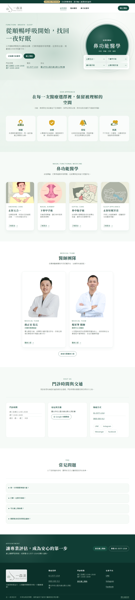
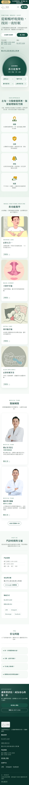

# UI 視覺基準 — 2026-08-07

**狀態：** 本文件是 2026-08-07 的 dated evidence，記錄療程卡影像修復與麵包屑語意
修正之後的現行畫面。它**不是** production 核准、政策核准，也不是跨作業系統的逐
像素 golden。現行工作權威仍是 [roadmap](../roadmap.md)、
[Phase 1 execution plan](../phase-1-execution-plan.md)
與 [decision register](../product/phase-1-decision-register.md)。

**與前一版的關係：** [2026-08-06 基準](ui-visual-baseline-2026-08-06.md)與
[2026-07-28 基準](ui-visual-baseline-2026-07-28.md)保留為歷史證據，目錄與圖片一張
都沒有動。**現行基線是本文件**；`check-structure.mjs` 釘住的也是這一份。

## 1. 為什麼重拍

[療程卡影像修復](2026-08-07-clinic-service-imagery.md)換掉了 `/clinic` 四張療程卡的
圖片（三張投影片改成只取插圖，資訊圖改用側睡人物插圖），前一版的官網圖因此不再代表
現況。麵包屑同輪從 `
` 改成 `<ol>`／`<li>`，但那兩條路由不在這十張裡。

## 2. 這一輪擋下了兩張被污染的圖

**基線是 approval artifact，不是「最新的截圖」。** 這次刻意先擷到新日期的目錄
（舊目錄因此不會被覆寫）、逐張 diff、確認差異都是預期的，最後才把 required paths
指過去。那道流程立刻付出了代價也立刻回本——**它擋下了兩張被殘留 `:hover` 污染的圖**：

| 圖 | 症狀 | 實際原因 |
| --- | --- | --- |
| `workbench--appointments-populated--phone` | 「到診」按鈕是 `#0f4537` 而不是 `#155c48`，12 457 個像素不同 | `--accent-solid-strong` 是 `.button-primary:hover` 的色。游標停在按鈕上 |
| `workbench--case-assigned-workload--desktop` | 表格列底色是 `--surface-soft` 而不是 `--canvas` | 列的 hover 底色。游標停在那一列上 |

兩者都不是程式碼變更造成的——這一輪沒有任何 commit 碰過 `workbench.css`、
`styles.css` 或工作臺的 HTML。**而且 2026-08-06 那一份也被污染過**，只是位置不同
（它的表格列是 hover 的，按鈕不是）。三份基線的同一張工作臺圖兩兩都不同，就是這樣
來的。

**原因是 `scenario.prepare()` 最後一次點擊會把游標留在原地**，而 hover 是有畫面的：
`.button-primary:hover` 換色並 `translateY(-1px)`。截圖前沒有人把游標移開。

修法是 `current-ui.spec.ts` 在截圖前 `page.mouse.move(-10, -10)`。驗證方式：
用 `(0, 0)` 與 `(-10, -10)` 兩個不同的「移開」座標各擷一次，**十張的 SHA-256 完全
相同**——游標的影響消失了，不是換了個位置藏起來。另外連續兩次相同設定的擷取也是
逐位元組相同，所以擷取本身是決定性的。

## 3. 與 2026-08-06 的實際差異

逐張 SHA-256 比對，10 張裡 4 張不同：

| 圖 | 差異 | 判定 |
| --- | --- | --- |
| `clinic--home--desktop` | 197 658 px（2.72%），集中在 y 1724–1923 | **預期**：療程卡四張圖換掉 |
| `clinic--home--phone` | 同上，單欄版 | **預期**：同上 |
| `workbench--appointments-populated--phone` | maxDelta 4 | **修正**：移除 08-06 的殘留 hover |
| `workbench--case-assigned-workload--desktop` | maxDelta 240 | **修正**：同上 |

其餘 6 張（`/booking` ×3、`/privacy`、工作臺 login 與 appointments 桌面）
**逐位元組相同**。

## 4. 參考畫面

完整集合（10 張）：

| Route／角色／狀態 | Viewport | 參考圖 |
| --- | ---: | --- |
| `/clinic`／public／home | 1280×900 | [clinic home desktop](assets/ui-visual-baseline-2026-08-07/clinic--home--desktop-1280x900--light.png) |
| `/clinic`／public／home | 375×812 | [clinic home phone](assets/ui-visual-baseline-2026-08-07/clinic--home--phone-375x812--light.png) |
| `/booking`／public／step 1 | 1280×900 | [booking step 1 desktop](assets/ui-visual-baseline-2026-08-07/booking--step-1--desktop-1280x900--light.png) |
| `/booking`／public／step 3，固定合成欄位 | 375×812 | [booking step 3 phone](assets/ui-visual-baseline-2026-08-07/booking--step-3-filled--phone-375x812--light.png) |
| `/booking`／public／step 3，低寬低高壓力狀態 | 320×568 | [booking step 3 stress](assets/ui-visual-baseline-2026-08-07/booking--step-3-filled--stress-320x568--light.png) |
| `/`／未登入／login gate | 1280×900 | [workbench login desktop](assets/ui-visual-baseline-2026-08-07/workbench--login--desktop-1280x900--light.png) |
| `/#appointments-section`／admin／一筆合成預約 | 1280×900 | [appointments desktop](assets/ui-visual-baseline-2026-08-07/workbench--appointments-populated--desktop-1280x900--light.png) |
| `/#appointments-section`／admin／一筆合成預約 | 375×812 | [appointments phone](assets/ui-visual-baseline-2026-08-07/workbench--appointments-populated--phone-375x812--light.png) |
| `/#case-section`／admin／到診、已指派個管 | 1280×900 | [case workload desktop](assets/ui-visual-baseline-2026-08-07/workbench--case-assigned-workload--desktop-1280x900--light.png) |
| `/privacy`／public／未核准告知草稿 | 375×812 | [privacy draft phone](assets/ui-visual-baseline-2026-08-07/privacy--draft-notice--phone-375x812--light.png) |

## 5. 可重現條件

- 指令：`corepack pnpm capture:ui`
- runner：Playwright 1.61.1／Chromium 149.0.7827.55／Windows 10.0.22631 x64
- 固定時間：`2026-07-29T01:00:00.000Z`
- locale／timezone：`zh-TW`／`Asia/Taipei`
- theme／motion：light／reduced
- DPR：1；workers：1；local server：`127.0.0.1:3211`
- **截圖前把游標移出視窗**（`page.mouse.move(-10, -10)`），見第 2 節。
- 每個情境先清空 `localStorage`，只寫固定 light theme；所有患者、帳號與預約均為
  明示合成值。
- 截圖前必須完成圖片 decode、字型 ready、network idle、兩個 animation frames，
  並驗證沒有水平 overflow、console error 或 warning。本批 **10 個情境的 console
  error 與 warning 均為 0**。

**`fixedTime` 刻意沿用前兩版的值**，不隨 `captureDate` 移動。它凍結的是合成資料的
時鐘（畫面上顯示的日期），不是擷取時間；兩者在 manifest 裡分開記錄，正是為了不讓
「畫面上的日期」被誤讀成「這批圖是哪天拍的」。

完整機器資訊、route、role、state、viewport、DPR、capture kind、console counts
與每張 PNG 的 SHA-256 在
[manifest.json](assets/ui-visual-baseline-2026-08-07/manifest.json)。
`scripts/check-structure.mjs` 會驗證 manifest 與十張 PNG 的集合、hash、寬度、
最小高度及 console 計數，避免圖片被靜默替換或遺失。

**它驗的是 manifest 與磁碟檔的一致性，不是基線與現況的一致性。** 產品改了而基線
沒重拍時，這道 gate 仍然是綠的——那是設計如此，不是漏洞，但要知道它管不到什麼。

## 6. 重拍時要改的四個地方

`current-ui.spec.ts` 的 `CAPTURE_DATE`、`check-structure.mjs` 的 required paths 與
`visualBaselineDirectory`、新的基準文件、以及規則書 §5.5 的指向。

`capture:ui` 會**就地覆寫** `CAPTURE_DATE` 指到的目錄。**先改日期常數再跑**——
這樣新圖落在新目錄，舊基線動都不會被動到，也才有東西可以 diff。忘了改日期就跑，
會把舊基線的圖換掉而 manifest 的 `captureDate` 不動。
